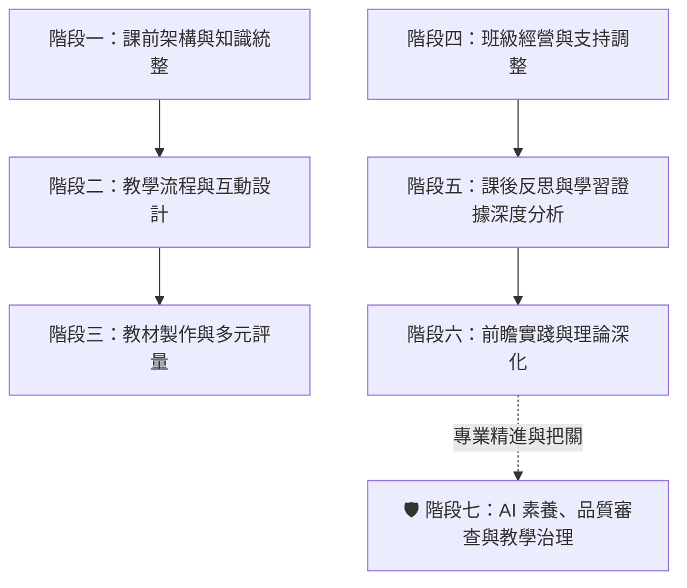

# Puti-AI 備課增能系統：從課程設計、作答分析、AI 治理到試題檢核的 40 個實戰指南

> **💡 教學科技核心思維：雙軌協同架構**
> * **通用對話型 AI（發散創意、架構與治理大腦，如 ChatGPT / Claude / Gemini / Copilot）**：
>   擅長教學活動發想、多層次概念改寫、素養提問設計、UbD 逆向教案、AI 生成教材多面向品質審查、學生 AI 學習規範、素養試題檢核、親師溝通文案與日常行政生成。
> * **文件知識庫型 AI（精準依據與知識管理大腦，如 NotebookLM）**：
>   **專門處理特定依據任務**：以指定校本教材/長篇 PDF 提煉重點、學生真實作答證據分析與迷思歸納、跨版本教科書比對、特教學生 IEP 需求萃取（需去識別化）、帶時間碼 YouTube 影音字幕轉化為學習單，以及生成雙人對話導讀腳本。

---

## 🧭 素養教學 AI 備課全景地圖



---

## 📑 目錄與使用頻率速查

- [一、課前架構與知識統整](#一課前架構與知識統整)
  - 01. 生成「指標—活動—評量」三位一體完整教案骨架 `[每單元 / 每週]`
  - 02. 長篇課綱與校本教材重點萃取（標註頁碼） `[學期初 / 備課週]` 【推薦文件知識庫 AI】
  - 03. 規劃單元分堂教學架構與進度表 `[學期初 / 每單元]`
  - 04. 跨版本教材客觀比對與融合統整教案 `[每學期 / 備課時]` 【推薦文件知識庫 AI】
  - 05. 教育文獻與政策公文轉教師行動指引 `[視需要 / 每月]` 【推薦文件知識庫 AI】
  - 06. 產生學年共備研討提綱與分工產出表 `[每週 / 隔週]`
  - 07. 共備研討紀錄轉化為具體行動清單 `[每週 / 隔週]` 【推薦文件知識庫 AI】
- [二、教學流程與互動設計](#二教學流程與互動設計)
  - 08. 設計 5 分鐘課堂引起動機暖身活動 `[每天 / 每堂課]`
  - 09. 規劃三層級差異化任務與彈性分組指引 `[每週 / 每單元]`
  - 10. 設計三層次課堂提問、預期回答與追問話術 `[每天 / 每堂課]`
  - 11. 抽象概念生活比喻講解與適用限制核對 `[每週 / 視需要]`
  - 12. 設計課室英語與雙語教學情境指令 `[每天 / 每堂課]`
  - 13. 閱讀文本分級化與階梯式鷹架調整 (Tiered Reading) `[每週 / 每單元]`
  - 14. 設計高層次探究思考與辯論題目 `[每單元 / 視需要]`
- [三、教材製作與多元評量](#三教材製作與多元評量)
  - 15. 生成素養學習單草稿與教師解答指引 `[每週 / 每單元]`
  - 16. 規劃簡報重點頁架構與學生認知負荷檢核 `[每週 / 備課時]`
  - 17. 板書版面佈局、提問節點與學生筆記指引 `[每天 / 每堂課]`
  - 18. 產生多元形成性評量題（含迷思概念誘答辨析） `[每週 / 每單元]`
  - 19. 隨堂小檢核與下一步補救教學策略 `[每天 / 每堂課]`
- [四、班級經營與個別支持](#四班級經營與個別支持)
  - 20. 全校研習與處室宣導重點轉化行動清單（標註版本與頁碼） `[開學前 / 每月]` 【推薦文件知識庫 AI】
  - 21. 撰寫客製化親師溝通信與開學通知初稿 `[開學前 / 視需要]`
  - 22. 開學第一堂課 40 分鐘完整流程與默契建立 `[開學初]`
  - 23. 班級民主共訂公約流程與正向行為支持機制 `[開學初 / 視需要]`
  - 24. 特殊學習需求課堂支持策略（普通班融合實務） `[開學初 / 視需要]`
  - 25. 萃取個別化教育計畫 (IEP) 課堂執行檢核清單（嚴格匿名） `[每學期 / 期初]` 【推薦文件知識庫 AI】
  - 26. 基於客觀觀察紀錄的學期評語與成長心態文字（匿名） `[期末]`
- [五、課後反思與學習證據深度分析](#五課後反思與學習證據深度分析)
  - 27. 語音零碎心得轉化為結構化教學反思日誌 `[每天 / 課後]`
  - 28. 整合實務經驗迭代升級為教案資產 2.0（前後對照） `[每學期 / 期末]` 【推薦文件知識庫 AI】
  - 29. 學生學習證據深度分析與下一步精準補救教學（匿名） `[每週 / 測驗後]` 【雙軌適用】
- [六、前瞻實踐與理論深化](#六前瞻實踐與理論深化)
  - 30. UbD 重理解逆向課程設計（以終為始檢核表） `[每學期 / 公開課]`
  - 31. 素養導向表現任務與 Rubrics 四級評量規準表 `[每單元 / 評量時]`
  - 32. PBL 6 週專題導向學習全流程規劃 `[每學期 / 彈性課]`
  - 33. 課堂遊戲化機制、闖關任務與安全替代方案 `[每月 / 期末複習]`
  - 34. 雙人對話式科普導讀腳本（通用教材版） `[每單元 / 視需要]` 【雙軌適用】
  - 35. 批判性思維：AI 故意出錯偵錯法（分開學生與解答版） `[每單元 / 視需要]`
  - 36. Google 表單純 CSV 文字快速出題（免手動複製） `[每週 / 段考前]`
  - 37. YouTube 帶時間碼字幕轉觀影導引單 `[每週 / 視需要]` 【推薦文件知識庫 AI】
- [🛡️ 七、AI 素養與教學治理](#-七ai-素養與教學治理)
  - 38. AI 生成教材上線前的多面向品質審查檢核 `[每次出教材 / 視需要]`
  - 39. 學生生成式 AI 課堂作業規範與學習歷程記錄表 `[每學期 / 專題前]`
  - 40. 依國教院素養導向評量原則進行題目檢核與修訂 `[段考前 / 命題時]`
- [🧠 八、教師高質量 Prompt 五星萬用架構](#-八教師高質量-prompt-五星萬用架構)
- [💡 九、教師 AI 工具選用決策速查表](#-九教師-ai-工具選用決策速查表)

---

# 一、課前架構與知識統整

### 01. 生成「指標—活動—評量」三位一體完整教案骨架 `[每單元 / 每週]`
* **適用情境**：單元備課起手式，建立對應學習內容與表現代碼的教案。
* **核心價值**：將學習表現、學習內容與評量證據置於核心，防編造代碼。
* **通用 Prompt 模板**：
  > 「我正在規劃〔年級〕〔學科〕單元：『〔單元主題與核心概念〕』，教學時間共〔40〕分鐘。
  > 請為我產出一份以「學習表現、學習內容與可觀察評量證據」為核心的完整教案骨架：
  > 1. 【核心指標對齊】：明確對應課綱之「學習表現代碼與條目」及「學習內容代碼與條目」，並轉換為可觀察檢核的具體學習目標。（⚠️ 若未提供正式課綱版本或來源文件，不可自行捏造學習表現代碼與學習內容代碼，請標示「需依正式課綱核對」）。
  > 2. 【評量證據預設】：在規劃活動前，先列出能證明學生達成上述目標的評量證據形式（如實作記錄、口語論證、學習單成品）。
  > 3. 【教學歷程表格】：包含時間分配（引起動機、發展活動、總結活動）、教師關鍵引導提問、學生活動任務與對應的形成性評量檢核點。
  > 4. 【動態差異化支持】：針對課堂中理解落後與超前學生的即時彈性支持策略。」

### 02. 長篇課綱與校本教材重點萃取（標註頁碼） `[學期初 / 備課週]` 【推薦文件知識庫 AI】
* **適用情境**：手邊有數十頁的課程指引、校本特色教材或教學手冊 PDF。
* **核心價值**：以指定教材為主要依據，快速萃取重點並強制標註原文頁碼出處。
* **操作與提問範例**：
  > 「請根據上傳的校本課程指引與單元教材 PDF，為我萃取並嚴格標註出處頁碼：
  > 1. 本單元對應的三大學習表現與學習內容代碼（附頁碼）
  > 2. 學生在學習此單元時最容易出現的 2 個迷思概念（附頁碼）
  > 3. 手冊中建議的關鍵教學活動與器材準備清單（附頁碼）。
  > 若文件中未提及某些項目，請明確註明「文件未記載」，嚴禁自行捏造。」

### 03. 規劃單元分堂教學架構與進度表 `[學期初 / 每單元]`
* **適用情境**：學期初排課、跨週分堂節奏規劃（如 4 節課的進度分配）。
* **核心價值**：邏輯清晰搭建單元骨架（引入 $\rightarrow$ 展開 $\rightarrow$ 探究 $\rightarrow$ 評量統整）。
* **通用 Prompt 模板**：
  > 「請為〔年級〕〔學科〕『〔單元名稱〕』設計一份共〔4〕節課（每節 40 分鐘）的單元教學進度表。
  > 請以表格呈現，欄位包含：節次、單元子題、核心概念、教學活動流程（起承轉合）、評量方式與延伸課後探究任務。」

### 04. 跨版本教材客觀比對與融合統整教案 `[每學期 / 備課時]` 【推薦文件知識庫 AI】
* **適用情境**：備課時手邊有兩到三個不同版本教科書，欲截長補短產出統整教案。
* **核心價值**：分析各版本在概念順序、實驗設計與生活情境之差異，產出融合教案。
* **操作與提問範例**：
  > 「我已上傳 A、B 兩家出版社同一單元的教科書章節 PDF。請為我分析：
  > 1. 【客觀版本比對】：從「概念引導脈絡」、「生活案例情境」與「實驗操作難易度」三向度進行比較，並標註各版頁碼。
  > 2. 【共同核心】：兩版本共同的核心學習重點。
  > 3. 【統整融合教案】：說明融合兩版優點的教學理由，並產出一份最適合班級課堂實施的統整單元教案。」

### 05. 教育文獻與政策公文轉教師行動指引 `[視需要 / 每月]` 【推薦文件知識庫 AI】
* **適用情境**：研讀長篇教學法論文、跨領域專案指引或公文評鑑指標。
* **核心價值**：附帶精確引文出處與頁碼；若文件中找不到資料需明確說明。
* **提問範例**：
  > 「請根據上傳的『〔公文或研究報告名稱〕』PDF，摘要出：
  > 1. 本政策/研究提出的核心實施原則（標註引文頁碼）
  > 2. 課堂落實時的具體行動檢核清單 3~5 項（標註引文頁碼）
  > 3. 教師在實施時應避免的偏誤與注意事項。
  > 若文件未提及某些面向，請明確回答「上傳文件中未包含此項資訊」，嚴禁自行揣測。」

### 06. 產生學年共備研討提綱與分工產出表 `[每週 / 隔週]`
* **適用情境**：擔任學年共備召集人，需在 45 分鐘內達成決策並分派產出。
* **核心價值**：明確劃分研討時間配比，產出具體責任分工與成果檢核表。
* **通用 Prompt 模板**：
  > 「我們學年預計進行〔年級〕〔學科〕『〔共備單元/主題〕』的共備會議（時間 45 分鐘）。
  > 請設計一份包含決策流程的結構化共備提綱：
  > 1. 【難點共識（10分鐘）】：確認本單元學生三大理解卡點與迷思概念。
  > 2. 【策略聚焦（20分鐘）】：討論並拍板共備核心教學活動與教學法。
  > 3. 【具體分工產出表（15分鐘）】：產出表格，包含：教材簡報、分層學習單、隨堂測驗題之負責教師欄位、繳交期限與成果檢驗規準。」

### 07. 共備研討紀錄轉化為具體行動清單 `[每週 / 隔週]` 【推薦文件知識庫 AI】
* **適用情境**：共備會議結束後，將發言筆記轉為可執行的分工表。
* **核心價值**：自動歸納教學共識、負責人欄位與下次共備準備事項。
* **提問範例**：
  > 「【請貼上共備會議速記或錄音文字稿】：
  > [請貼上今日共備討論記錄]
  > 
  > 請根據上述研討紀錄，整理出：
  > 1. 今日達成的三項教學共識
  > 2. 各班級老師的分工事項與繳交期限表格（包含：教具準備、學習單編寫、簡報製作）
  > 3. 下次共備需帶來的課堂實施成果與檢討項目。」

---

# 二、教學流程與互動設計

### 08. 設計 5 分鐘課堂引起動機暖身活動 `[每天 / 每堂課]`
* **適用情境**：課堂一開始，讓學生快速沉澱並聚焦在今日主題。
* **核心價值**：提供猜謎、3-2-1 快速提問法、圖片聯想等多種破冰形式。
* **通用 Prompt 模板**：
  > 「教學主題是『〔單元主題與核心概念〕』，對象為〔國小年級〕。
  > 請設計 3 個不同形式、可在 3~5 分鐘內完成的課堂破冰暖身活動（例如：日常現象猜謎、3-2-1 快速提問法、實物圖片聯想），需能有效引發好奇心且操作簡便。」

### 09. 規劃三層級差異化任務與彈性分組指引 `[每週 / 每單元]`
* **適用情境**：依據學生當前理解程度動態分組，避免固定能力標籤化。
* **核心價值**：提供基礎鷹架、標準熟練與深度挑戰任務卡，含教師走動引導語。
* **通用 Prompt 模板**：
  > 「針對『〔核心概念或技能〕』，請為〔年級〕設計三層級的差異化課堂任務，並採取動態彈性分組機制（避免學生被固定貼標籤）：
  > 1. 【基礎鷹架任務（需要提示步驟）】：提供具體物操作、塗色分割或填空鷹架。
  > 2. 【標準熟練任務（掌握基本應用）】：生活情境題解構與組內互助解題。
  > 3. 【深度挑戰任務（進階推論與逆向思考）】：反向問題設計、生活情境優化或開放式探究。
  > 請分別說明各層級任務卡內容、自我檢核點，以及教師巡堂時的引導提問語。」

### 10. 設計三層次課堂提問、預期回答與追問話術 `[每天 / 每堂課]`
* **適用情境**：備課時撰寫提問講稿，預想學生可能回答並準備鷹架追問。
* **核心價值**：避免課堂冷場或卡關，精準引導學生從事實走向高階思考。
* **通用 Prompt 模板**：
  > 「請針對『〔單元主題與核心概念〕』，設計三個層次分明的引導式課堂提問：
  > 1. 【事實與理解層次】：提問句 + 預期學生回答 + 若學生答不出時的鷹架提示語。
  > 2. 【分析與推論層次】：提問句 + 預期學生回答 + 深化思考的「追問話術（Probing Question）」。
  > 3. 【評鑑與創造層次】：開放式決策提問 + 引導正反辯證的討論引導語。」

### 11. 抽象概念生活比喻講解與適用限制核對 `[每週 / 視需要]`
* **適用情境**：抽象概念難以理解時提供比喻，並明確指出比喻的邊界限制。
* **核心價值**：生活比喻講解 + 科學概念對照表 + 避免比喻失真檢核題。
* **通用 Prompt 模板**：
  > 「請將抽象概念『〔學科核心概念〕』改寫為生活化講解：
  > 1. 【生活比喻說明】：運用學生熟悉的生活情境（如〔工廠運作/日常交通/分裝點心〕）進行生動譬喻。
  > 2. 【概念對照檢核表】：以表格呈現「比喻中的事物」與「真實科學/學科原理」的一一對應關係。
  > 3. 【比喻限制說明與防誤解檢核】：明確說明這個比喻在哪個環節與真實原理不同，並設計 1 道口語檢核題，確認學生未因比喻而產生新迷思。」

### 12. 設計課室英語與雙語教學情境指令 `[每天 / 每堂課]`
* **適用情境**：雙語綜合、美勞或體育課堂中的日常指導。
* **核心價值**：提供中文、地道英文句型與口語發音/重音提示。
* **通用 Prompt 模板**：
  > 「我正在規劃一堂〔年級〕〔雙語學科：如雙語體育/美勞/生活〕，主題為『〔課堂主題〕』。
  > 請提供 8 句最常用的課堂口語指令，格式包含：繁體中文、自然地道的英語表達、發音與重音提示。」

### 13. 閱讀文本分級化與階梯式鷹架調整 (Tiered Reading) `[每週 / 每單元]`
* **適用情境**：輸入指定原文，產出入門、標準、進階三種閱讀難度文本。
* **核心價值**：嚴格保留原文事實與數據，若無數據則明確標示不捏造。
* **通用 Prompt 模板**：
  > 「【原始文本輸入】：
  > [請貼上欲分級的原始閱讀文本]
  > 
  > 請將上述文本改寫為三個不同閱讀難度的梯次版本（要求：必須嚴格保留原文的事實與數據，不可自行增加未提及的資料；若原文未提供數據，進階版請標示「原文未提供數據，本項目略過」，嚴禁捏造）：
  > 【Level 1 入門版（初階閱讀）】：簡化句型與生難詞、標註重點關鍵字，並附 2 題是非題檢核理解。
  > 【Level 2 標準版（中年級適用）】：保留完整段落因果結構，附 2 題概念問答題。
  > 【Level 3 進階版（高年級/挑戰）】：融入深度因果分析與數據比較（限基於原文），附 1 題開放式短評寫作引導。」

### 14. 設計高層次探究思考與辯論題目 `[每單元 / 視需要]`
* **適用情境**：高年級專題探究、時事議題討論或班級辯論會。
* **核心價值**：結構化產出正反論點與引導學生尋找證據的關鍵問題。
* **通用 Prompt 模板**：
  > 「主題為『〔探究或時事議題〕』。請為國小高年級設計 2 個結構化的課堂辯論或探究題目，並附帶：正反雙方可能主張的 3 個核心論點、以及引導學生尋找支持證據的引導問題。」

---

# 三、教材製作與多元評量

### 15. 生成素養學習單草稿與教師解答指引 `[每週 / 每單元]`
* **適用情境**：快速生成結構完整、題型多元的學習單文字草稿與參考答案。
* **核心價值**：包含生活情境題、圖表判讀與開放探索題，方便教師複製排版。
* **通用 Prompt 模板**：
  > 「請為〔年級〕〔學科〕單元『〔單元名稱〕』設計一份 A4 學習單文字草稿與教師參考解答：
  > 1. 【學生版學習單內容】：
  >    - 情境引入題（以貼近該年段學生生活經驗為背景）
  >    - 觀念理解與圖表判讀題 2 題（預留作答方框與算式空格）
  >    - 生活實踐開放探索題 1 題。
  > 2. 【教師專用參考解答與評分指引】：附帶每題標準答案、解題步驟及開放題評分標準。」

### 16. 規劃簡報重點頁架構與學生認知負荷檢核 `[每週 / 備課時]`
* **適用情境**：製作教學簡報（PPT / Canva）前，先提煉純文字重點。
* **核心價值**：每頁不超過 3 點，字數精簡，並提供插圖概念建議。
* **通用 Prompt 模板**：
  > 「我需要製作〔5〕頁關於『〔簡報主題〕』的教學簡報。請為每頁規劃：
  > 1. 簡報核心標題
  > 2. 視覺化重點文字（每頁不超過 3 點，每點在 15 字以內，符合國小生認知負荷）
  > 3. 建議搭配的示意插圖或圖表說明。」

### 17. 板書版面佈局、提問節點與學生筆記指引 `[每天 / 每堂課]`
* **適用情境**：上課前規劃黑板左右分區、流程圖箭頭與學生筆記重點。
* **核心價值**：用符號與左右分區展現板書層次，上課書寫不雜亂。
* **通用 Prompt 模板**：
  > 「針對『〔單元核心主題〕』，請設計一份結構化黑板板書與筆記指引：
  > 1. 【黑板左右分區架構】：用符號（如 ├──、→、[框]）呈現黑板左側（複習/舊經驗）、中央（核心概念思維圖）、右側（課堂任務/作業）。
  > 2. 【板書書寫節奏】：標註哪些內容應在教師提問後由學生回答再填入黑板。
  > 3. 【學生筆記本對應指引】：說明學生筆記本應如何抄寫或繪製精簡心智圖。」

### 18. 產生多元形成性評量題（含迷思概念誘答辨析） `[每週 / 每單元]`
* **適用情境**：隨堂隨選測驗、即時反饋系統（Kahoot/Quizizz）命題。
* **核心價值**：含正確答案、詳細解析，以及誘答選項背後的迷思診斷。
* **通用 Prompt 模板**：
  > 「請針對『〔核心概念〕』為〔年級〕設計 4 題單選題。每題需提供：正確答案、詳細解析，以及針對 3 個錯誤選項分別說明其背後反映的學生迷思概念。」

### 19. 隨堂小檢核與下一步補救教學策略 `[每天 / 每堂課]`
* **適用情境**：下課前 3 分鐘快速檢視全班吸收度，題量控制在 1~2 題。
* **核心價值**：控制字數題量，附帶教師後續 3 分鐘快速補救教學策略。
* **通用 Prompt 模板**：
  > 「請為今日課堂主題『〔今日課堂主題〕』設計一份可在 3 分鐘內作答完畢的「隨堂小檢核」（題量控制在短答/選擇 2 題以內）：
  > 1. 【隨堂小檢核題目（學生作答）】：
  >    - 今日核心概念檢核題 1 題（選擇題或 20 字以內極短答）
  >    - 一個我今天最清楚的觀念 / 一個我還想進一步搞懂的疑問。
  > 2. 【教師診斷與補救指引】：說明若學生在第 1 題答錯時，下節課開始前可採取的 3 分鐘快速補救教學策略。」

---

# 四、班級經營與個別支持

### 20. 全校研習與處室宣導重點轉化行動清單（標註版本與頁碼） `[開學前 / 每月]` 【推薦文件知識庫 AI】
* **適用情境**：開學前夕處理大量處室宣導文件、研習逐字稿與行事曆。
* **核心價值**：提煉死線、請假流程與校安 SOP；嚴禁 AI 自行臆測法規。
* **提問範例**：
  > 「根據上傳的開學前全體教師研習資料 PDF，請幫我整理出：
  > 1. 與導師班級經營直接相關的關鍵日程與表單繳交死線（標註文件版本與原文頁碼）
  > 2. 新學期學生出缺勤與請假通報規範變更重點（標註原文頁碼）
  > 3. 校園偶發事件與校安通報處理流程（嚴格依據文件內容列出，未提及處請註明「文件未記載」，不可自行補充臆測）。」

### 21. 撰寫客製化親師溝通信與開學通知初稿 `[開學前 / 視需要]`
* **適用情境**：開學給家長的一封信、班級常規通知與親師合作守則。
* **核心價值**：展現溫暖與教育理念，清楚條列必備學用品與溝通時段。
* **通用 Prompt 模板**：
  > 「請為一位國小導師撰寫『開學給家長的一封信』。語氣需展現專業、溫暖、親切且條理分明。
  > 內容包含：
  > 1. 歡迎詞與班級教育核心理念（請預留 [班級名稱]、[導師姓名] 變數）
  > 2. 開學常規與學童必備文具生活用品清單提醒（預留 [必備用品清單] 變數）
  > 3. 親師溝通方式與最佳聯絡時段守則（預留 [聯絡時間/管道] 變數）。」

### 22. 開學第一堂課 40 分鐘完整流程與默契建立 `[開學初]`
* **適用情境**：接任新班級的第一堂課，建立班級默契、常規與破冰。
* **核心價值**：規劃完整 40 分鐘流程（破冰話術、互動遊戲、默契手勢）。
* **通用 Prompt 模板**：
  > 「我是一位新接手〔年級〕班級的導師。請幫我規劃開學第一堂課（40 分鐘）的完整教學流程：
  > 1. 【引起動機（10分鐘）】：幽默自介話術 + 「尋找班級共同點」全班破冰互動。
  > 2. 【默契建立（20分鐘）】：師生共同約定 3 個課堂注意力口令/拍手節奏手勢。
  > 3. 【心願與目標（10分鐘）】：引導每位學生在便利貼上寫下一句新學期給自己的期許並張貼於願望樹。」

### 23. 班級民主共訂公約流程與正向行為支持機制 `[開學初 / 視需要]`
* **適用情境**：引導學生共同討論制定班規，避免公開排名與過度獎勵化。
* **核心價值**：擺脫負面禁止字眼，化為正向公約與合作榮譽勳章。
* **通用 Prompt 模板**：
  > 「請為〔年級〕設計一套「班級民主共訂公約」的引導教案與獎勵機制：
  > 1. 【共訂引導步驟】：如何引導全班分組討論「我們希望在什麼樣的班級氛圍中學習」，並轉化為 5 條以正向語言表述的公約。
  > 2. 【正向行為支持 (PBS)】：設計一套非懲罰性、強調團隊合作與個人成長的榮譽機制（需特別注意：避免學生間的公開排名比較與過度物質獎勵化）。
  > 3. 【修復式對話指引】：當學生違反公約時，教師可使用的 3 句平靜引導修復對話。」

### 24. 特殊學習需求課堂支持策略（普通班融合實務） `[開學初 / 視需要]`
* **適用情境**：班上有注意力集中困難或書寫肌力需求學童時的課堂調整。
* **核心價值**：提供視覺檢核、分段任務等策略（註明不可取代特教專業評估）。
* **通用 Prompt 模板**：
  > 「班上有一位在課堂聽講時容易分心、書寫精細動作較慢的〔三年級〕學生（注：本建議僅供普通班教學調整參考，不可取代特教專業診斷）。
  > 請提供 4 個可在普通班課堂中自然落實的個別化學習支持策略（例如：視覺提示檢核卡、分段任務指引、同儕支持角色分工、多元作答形式）。」

### 25. 萃取個別化教育計畫 (IEP) 課堂執行檢核清單（嚴格匿名） `[每學期 / 期初]` 【推薦文件知識庫 AI】
* **適用情境**：閱讀特教移轉的 IEP 文件，提煉普通班日常具體配合要點。
* **核心價值**：⚠️ 請務必先將學生姓名學號去識別化；僅引用文件已記載內容。
* **提問範例**：
  > 「【重要隱私提醒：上傳前請確認已將學生姓名、學號等個資完全去識別化（匿名）】
  > 請從上傳的已匿名 IEP 文件中，僅引用文件已記載內容摘錄出普通班導師在日常教學中需落實的：
  > 1. 課堂座位安排與環境調整建議
  > 2. 情緒波動時的正向應對步驟
  > 3. 定期評量時的調整措施（如延長時間、報讀支援）。
  > 回答必須嚴格限於文件已有記載內容，未提及之處請明確註明「文件未記載」，嚴禁自行補充推論。」

### 26. 基於客觀觀察紀錄的學期評語與成長心態文字（匿名） `[期末]`
* **適用情境**：期末撰寫學生成績單評語，輸入客觀行為紀錄生成評語。
* **核心價值**：避免空泛套話，生成溫暖親切與條理激勵兩種風格。
* **通用 Prompt 模板**：
  > 「【學生客觀課堂觀察事實（已去識別化）】：
  > [請貼上學生的客觀課堂觀察紀錄與具體事例，例如：熱心服務、實驗操作敏銳、討論積極但書寫偶有粗心]
  > 
  > 請根據上述客觀觀察，為其撰寫期末成績單的『日常綜合表現評語』（字數約 80~100 字）：
  > 【要求】：語氣溫暖肯定、具體指出亮點並以「成長心態（Growth Mindset）」提出改進建議。請提供「溫暖親切風」與「條理激勵風」2 種版本供教師挑選。」

---

# 五、課後反思與學習證據深度分析

### 27. 語音零碎心得轉化為結構化教學反思日誌 `[每天 / 課後]`
* **適用情境**：下課後透過手機語音輸入零碎心得，自動轉為專業反思。
* **核心價值**：自動歸納課堂亮點、問題成因與下次改善行動 (Action Items)。
* **通用 Prompt 模板**：
  > 「【請貼上課後隨手語音逐字稿或碎筆記】：
  > [請貼上今日教學後的隨手雜記]
  > 
  > 請幫我將上述課堂雜記整理為專業的教學反思日誌：
  > 1. 本堂教學亮點與成功策略
  > 2. 遭遇問題與原因剖析（如時間掌控、學生迷思、器材操作等）
  > 3. 下次教學優化的具體改善行動（Action Items 清單）。`

### 28. 整合實務經驗迭代升級為教案資產 2.0（前後對照） `[每學期 / 期末]` 【推薦文件知識庫 AI】
* **適用情境**：單元結束或學期末，將反思筆記與原教案整合成永續教材。
* **核心價值**：輸入原始教案與反思筆記，產出教案 2.0 與詳細修改前後對照表。
* **提問範例**：
  > 「【請上傳或貼上原始教案 (1.0)】：
  > [請貼上原始教學教案內容]
  > 
  > 【請上傳或貼上本學期課後反思筆記】：
  > [請貼上本單元各課的反思筆記]
  > 
  > 請比對上述兩份資料：
  > 1. 【前後修改對照表】：條列在「時間分配」、「引導提問」與「活動步驟」上的具體修改原因與差異。
  > 2. 【優化升級版教案 2.0】：產出包含最新修正的完整單元教案，並特別標註學生常見迷思提醒。」

### 29. 學生學習證據深度分析與下一步精準補救教學（匿名） `[每週 / 測驗後]` 【雙軌適用】
* **適用情境**：收回隨堂小檢核、學習單或小考後，深入分析真實作答證據。
* **核心價值**：區分統計與原始作答、樣本數不足質性約束、禁少量資料推論個別能力與重新檢核題。
* **通用 Prompt 模板**：
  > 「【學生真實作答數據/文字記錄（已完全去識別化/匿名）】：
  > [請貼上隨堂小檢核、學習單、小考答題分佈或課堂觀察紀錄]
  > 
  > 【教學單元與年級】：國小〔年級〕〔學科〕『〔單元主題〕』
  > 
  > 請根據上述真實學習證據，進行深入學情分析與補救教學規劃：
  > 1. 【常見迷思概念分類與原始證據】：整理出學生最集中的 2~3 個錯誤概念，剖析背後的思維卡點，並具體引用學生的原始作答語句/算式為佐證（嚴禁隨意給學生貼負面標籤）。（⚠️ 證據約束：若僅提供「人數統計或答題分佈」而沒有學生「原始作答語句/算式/選項細節」，請勿自行過度推測其具體迷思原因，僅能進行整體分佈狀態分析與建議後續抽樣訪談方向）。
  > 2. 【理解程度分佈評估（樣本數不足約束）】：若作答樣本數不足時，請勿輸出不具統計意義的百分比，應改以「質性描述＋具體人數分佈」，並說明判斷依據與不確定性；且不得由少量資料推論個別學生整體能力，嚴禁貼標籤。
  > 3. 【不具負面標籤的彈性分組與同儕鷹架】：設計組內互助、動態分站任務的彈性分組策略。
  > 4. 【下一節課 5～10 分鐘補救教學】：設計開場可立即實施的「對比澄清提問」與概念重構引導話術。
  > 5. 【不同程度學生後續任務卡】：提供基礎鞏固卡與進階探究卡。
  > 6. 【重新檢核題 (Re-check Question)】：設計 1 道能立即檢視補救成效的課堂小測驗題。」

---

# 六、前瞻實踐與理論深化

### 30. UbD 重理解逆向課程設計（以終為始檢核表） `[每學期 / 公開課]`
* **適用情境**：公開授課、大型主題統整單元或校訂課程教案設計。
* **核心思維**：先確認「預期學習結果」$\rightarrow$ 決定「評量證據」$\rightarrow$ 再規劃「學習體驗」。
* **通用 Prompt 模板**：
  > 「請依據 UbD（Understanding by Design）逆向設計架構，為〔年級〕〔學科主題〕規劃一份單元教案架構，並以可執行的表格呈現：
  > 1. 【階段一：預期學習結果】：核心概念（Big Ideas）、本質問題（Essential Questions）、核心素養指標。
  > 2. 【階段二：評量證據】：真實情境表現任務（GRASPS 模型：目標/角色/對象/情境/產出/標準）、多元檢核方式。
  > 3. 【階段三：學習計畫】：符合 WHERETO 架構的教學歷程設計與時間規劃。」

### 31. 素養導向表現任務與 Rubrics 四級評量規準表 `[每單元 / 評量時]`
* **適用情境**：輸入學生具體表現任務，反推客觀的四級評量規準。
* **核心價值**：明確四等級標準（優異、熟練、基礎、待加強）與可觀察指標。
* **通用 Prompt 模板**：
  > 「學生需完成一項表現任務：『〔請輸入具體表現任務，如：為社區設計防汛圖卡/設計一份保溫杯改良方案〕』。
  > 請為此任務由成功條件反推設計一份評量規準表（Rubric）：
  > - 評量向度 3~4 項（如：核心知識應用、解決方案可行性、版面/口語表達、團隊協作）。
  > - 表現層級：4 級（優異表現）、3 級（符合標準）、2 級（接近標準）、1 級（需要協助），每個欄位需有具體可觀察的行為描述指標。」

### 32. PBL 6 週專題導向學習全流程規劃 `[每學期 / 彈性課]`
* **適用情境**：規劃校訂課程或彈性學習節數的 6 週 PBL 專題課程。
* **核心價值**：產出核心驅動問題、每週里程碑任務、公開成果與評量規準。
* **通用 Prompt 模板**：
  > 「我們要為〔年級〕規劃一個為期 6 週的 PBL 專題課程：『〔專題主題名稱〕』。
  > 請設計完整 PBL 專題架構：
  > 1. 【核心驅動問題（Driving Question）】：具挑戰性、貼近生活且能引發探究的問題。
  > 2. 【週次進度規劃表（1~6週）】：每週主題、學生探究任務、跨領域知識點與檢核里程碑。
  > 3. 【公開發表成果（Public Product）】：最終向全校師生發表的形式建議與評量規準。」

### 33. 課堂遊戲化機制、闖關任務與安全替代方案 `[每月 / 期末複習]`
* **適用情境**：單元總複習、期末闖關活動，提升學習投入度。
* **核心價值**：結合情境劇情、三道梯度關卡、積分勳章與安全替代備案。
* **通用 Prompt 模板**：
  > 「請將〔年級〕〔學科〕『〔複習主題〕』複習課程，改編成一個沉浸式闖關任務：『〔闖關故事名稱〕』。
  > 需包含：
  > 1. 任務背景情境與角色引導
  > 2. 三道不同挑戰梯度的關卡（基礎操作關、生活解謎關、終極挑戰關）
  > 3. 小組合作計分與榮譽勳章機制
  > 4. 課堂安全注意事項與針對行動不便或特殊需求學生的替代方案。」

### 34. 雙人對話式科普導讀腳本（通用教材版） `[每單元 / 視需要]` 【雙軌適用】
* **適用情境**：製作學生課前預習聽力素材、無障礙聽覺教材或播客腳本。
* **核心價值**：可直接用於錄音，或上傳 NotebookLM 生成 Audio Overview 音訊。
* **通用 Prompt 模板**：
  > 「【教材主題或重點段落】：
  > [請貼上教材內容或核心知識點]
  > 
  > 請將上述內容改寫為一份 5 分鐘的「雙人對話式科普廣播腳本」（適合兩位主持人一問一答，深入淺出）：
  > 【對象】：小學〔年級〕學生。
  > 【要求】：多運用生活化比喻，語氣生動幽默，並在文末由主持人總結 3 個口訣記憶點。」

### 35. 批判性思維：AI 故意出錯偵錯法（分開學生與解答版） `[每單元 / 視需要]`
* **適用情境**：培養學生概念精熟與批判思考；⚠️ 教師課前務必逐一核對。
* **核心價值**：故意埋入 3 個常見迷思，引導學生化身小偵探揪出錯誤。
* **通用 Prompt 模板**：
  > 「請根據『〔概念名稱〕』設計一份「科學偵錯小偵探」任務單：
  > 1. 【學生版閱讀短文（約250字）】：文章中故意埋入 3 個國小生常見的迷思錯誤（如：〔具體迷思方向〕）。
  > 2. 【教師專用解答與引導手冊】：條列 3 處錯誤位置、正確原理解釋，以及課堂討論時引導學生發現矛盾的提問句。
  > （⚠️ 提醒：課堂實施前教師必須逐項查核，並在當堂完成澄清總結，避免學生形成錯誤概念）。」

### 36. Google 表單純 CSV 文字快速出題（免手動複製） `[每週 / 段考前]`
* **適用情境**：快速建構線上測驗，只輸出純 CSV 文字以利直接匯入。
* **核心價值**：只輸出標準純 CSV，不要任何 Markdown 圍欄（```）或多餘問候語。
* **通用 Prompt 模板**：
  > 「請針對〔年級〕〔學科〕『〔測驗主題〕』設計 5 題單選題。
  > 【格式嚴格要求】：請直接輸出「純 CSV 文字內容」，不要包含任何 Markdown 程式碼標籤（例如 \`\`\`csv）、問候語或後續說明文字。
  > 若欄位內容包含逗號，請以雙引號（"）包覆。
  > 欄位順序：
  > 題目內容,選項A,選項B,選項C,選項D,正確答案,解析說明
  > （備註：Google 表單原生不支援直接匯入 CSV，產出之純 CSV 文字可複製至 Google 試算表，再搭配 Form Builder 等外掛一鍵轉為 Google 表單測驗題）。」

### 37. YouTube 帶時間碼字幕轉觀影導引單 `[每週 / 視需要]` 【推薦文件知識庫 AI】
* **適用情境**：找到優質科普或歷史 YouTube 影片，快速轉為觀影導引單。
* **核心價值**：依據帶時間碼字幕逐字稿，提取精確時間戳記與關鍵思考題。
* **提問範例**：
  > 「請根據上傳的「帶時間碼字幕逐字稿 (SRT/VTT)」，為學生設計一份「邊看邊思考的觀影任務單」：
  > 1. 【核心概念摘要】：影片說明的 3 大關鍵知識點。
  > 2. 【時間戳記思考題】：必須依據字幕中的時間碼（如 02:15、05:40），設計 3 題引導學生觀察影片細節的檢核題（若字幕未附時間碼，請明確提示「未附時間碼，僅列概念順序」）。
  > 3. 【課後延伸討論】：一題結合日常生活的反思應用題。」

---

# 🛡️ 七、AI 素養與教學治理

### 38. AI 生成教材上線前的多面向品質審查檢核 `[每次出教材 / 視需要]`
* **適用情境**：將 AI 產出的教案、學習單或簡報在印給學生前進行嚴格審查。
* **核心價值**：標註嚴重度等級、以最新指引為準、來源頁碼、授權狀態與修正定稿。
* **通用 Prompt 模板**：
  > 「【待審查之 AI 生成教材內容】：
  > [請貼上欲檢查的教案、學習單或評量內容]
  > 
  > 【教學對象與學科】：國小〔年級〕〔學科〕
  > 
  > 請依據教育部 AI 使用指引與 UNESCO 教師能力架構（⚠️ 請以使用者提供的最新版本文件為準；若未提供特定版本，則以現行最新公告原則為基準），對上述內容進行多面向品質審查，並逐項評估與修訂：
  > 1. 【課綱與素養對齊度】：是否符合該年段核心素養，而非超綱或偏離重點？
  > 2. 【學科事實與科學正確性】：是否有科學概念錯誤、歷史事實捏造或文字幻覺？
  > 3. 【年齡與認知適切性】：用詞與排版難度是否符合國小〔年級〕認知負荷？
  > 4. 【文化、性別與族群偏見檢核】：是否存在性別、族群、城鄉刻板印象或道德說教？
  > 5. 【個資防護與機密安全】：是否包含任何未去識別化的學生或教師個資？
  > 6. 【著作權、來源與授權狀態】：是否侵犯他人著作權？請明確標註「參考來源網址/頁碼」、「授權狀態（CC授權/公共領域）」、「是否需標註作者」以及「是否可修改與公開分享」，並加註 AI 輔助生成說明。
  > 7. 【閱讀與多模態可及性】：用字排版是否便於不同閱讀需求學童理解？
  > 8. 【問題嚴重度與修訂對照表】：以表格條列所有問題，包含「問題位置」、「問題嚴重度（重大錯誤／需要修正／可改善）」、「判斷依據」與「建議修正內容」，並在最後輸出「修訂後可直接使用版本」。」

### 39. 學生生成式 AI 課堂作業規範與學習歷程記錄表 `[每學期 / 專題前]`
* **適用情境**：在課堂引導學生使用 AI 輔助探究時，建立動態紅綠燈、口頭檢核與防誤判機制。
* **核心價值**：依年級調整規則，包含 Prompt 歷程表、Oral Check 理解檢核與禁單靠偵測器判定。
* **通用 Prompt 模板**：
  > 「我們即將在〔年級〕〔學科/主題〕引導學生在課堂任務中使用生成式 AI 輔助探究。
  > 請為此課堂設計一套「學生 AI 學習倫理、歷程記錄與理解檢核模組」：
  > 1. 【課堂 AI 使用紅綠燈（依年級與學校政策動態調整，非一體適用）】：
  >    - 🟢 綠燈（鼓勵使用）：腦力激盪、尋找靈感、文法修飾、程式除錯。
  >    - 🟡 黃燈（需查證標註）：事實查詢（必須手動查證第二來源並附出處）。
  >    - 🔴 紅燈（嚴格禁止）：直接複製貼上 AI 回答當作自己的作業、輸入真實個資。
  > 2. 【AI 提問與反思歷程記錄表（學生學習單欄位）】：包含「我問了 AI 什麼（Prompt）」、「AI 怎麼回答」、「我發現哪裡可能有誤或不足」、「我如何修改為自己的想法」。
  > 3. 【口頭說明與理解檢核 (Oral Defense Check)】：設計 2 個課堂口頭提問，確認學生是真正理解概念而非僅有文字生成紀錄。
  > 4. 【透明揭露與引用聲明範例】：一段 30 字的作業頁尾 AI 輔助聲明填空範本。
  > 5. 【多元評量規準 (Rubric)】：包含「批判性查證」與「原創性貢獻」評分規準。
  > （⚠️ 評量嚴格守則：不得以坊間「AI 生成文字偵測器」單獨判定學生是否使用 AI，應綜合其學習歷程記錄表、口頭概念說明與作品修訂軌跡進行綜合專業判斷）。」

### 40. 依國教院素養導向評量原則進行題目檢核與修訂 `[段考前 / 命題時]`
* **適用情境**：段考出題、單元評量或題庫命題後的品質審核與防爭議修改。
* **核心價值**：依國教院規準檢核真實情境、唯一最佳解/評分依據與誘答迷思。
* **通用 Prompt 模板**：
  > 「【待檢核之原創試題與答案】：
  > [請貼上設計好的 1~3 題素養導向題目、選項與參考答案]
  > 
  > 【適用年級與評量目標】：國小〔年級〕，測驗核心概念為『〔概念〕』
  > 
  > 請依據國家教育研究院「素養導向評量品質原則」，進行深度審查與修訂：
  > 1. 【情境真實性檢核】：情境是否為學生真實生活經驗或有意義的探究脈絡，而非「偽素養（穿靴戴帽的長題幹）」？
  > 2. 【指標對齊與認知層次】：題目真正測驗的是高層次推論、理解，還是單純記憶？
  > 3. 【答案合理性與評分依據】：選擇題檢查是否只有「單一最佳答案」；開放式/非選題檢查是否有「明確客觀之評分指引與給分依據」。
  > 4. 【誘答選項品質診斷】：錯誤選項是否均基於常見迷思（合理誘答），而非湊數的荒謬選項？
  > 5. 【國教院原則修訂版】：提供修訂前後對照表，並輸出「修訂後的高品質素養題定稿」。」

---

# 🧠 八、教師高質量 Prompt 五星萬用架構

> 掌握 5 大核心要素，任何提示詞套用此公式，生成品質提升 80%：

$$\text{高品質教學 Prompt} = \text{角色 (Role)} + \text{任務 (Task)} + \text{對象 (Target)} + \text{情境脈絡 (Context)} + \text{格式限制 (Constraints)}$$

```markdown
1. 【角色 (Role)】：你是一位擁有 15 年國小教學經驗的自然專任教師與課程設計專家...
2. 【任務 (Task)】：請為我設計一堂 40 分鐘的『磁鐵性質探究』教案骨架...
3. 【對象 (Target)】：學習對象為國小三年級學生，先備知識已知磁鐵能吸鐵...
4. 【情境脈絡 (Context)】：教室配備平板與分組實驗器材，採 4 人小組合作學習...
5. 【格式限制 (Constraints)】：請以 Markdown 表格呈現時間分配、教師提問、學生活動與評量指標，文字具體簡明，避免空洞理論。
```

---

## 💡 九、教師 AI 工具選用決策速查表

| 備課任務類型 | 推薦工具屬性 | 常用工具代表 | 選擇理由與時機 |
| :--- | :---: | :---: | :--- |
| **教案骨架、提問與追問、差異化分層** | **通用對話型 AI** | ChatGPT / Claude / Gemini / Copilot | 發散思考強、文筆自然、可隨意指定語氣與分層難度 |
| **研讀長篇課綱、教科書指引、論文** | **文件知識庫型 AI** | NotebookLM | 以指定文本為主要依據，附帶頁碼段落，大幅降低幻覺 |
| **學生隨堂小檢核 / 測驗作答證據深度分析** | **雙軌適用** | 通用對話 AI / NotebookLM | 彙整真實學生作答數據，精準分群並輸出 5~10 分鐘補救策略 |
| **AI 生成教材多面向品質審查與修訂** | **通用對話型 AI** | ChatGPT / Claude / Gemini / Copilot | 嚴格依據教育部指引審查課綱對齊、事實正確、偏見、智財與可及性 |
| **學生生成式 AI 課堂作業規範與歷程** | **通用對話型 AI** | ChatGPT / Claude / Gemini / Copilot | 建立動態紅綠燈規範、提問歷程表與口頭檢核機制 (Oral Check) |
| **素養導向評量題品質檢核 (國教院原則)** | **通用對話型 AI** | ChatGPT / Claude / Gemini / Copilot | 檢驗真實情境、唯一最佳解/評分依據、誘答合理性與排版清晰度 |
| **帶時間碼 YouTube 影音轉觀影導引單** | **文件知識庫型 AI** | NotebookLM | 支援直接貼上 YouTube 連結，自動精準萃取影音字幕與時間碼 |
| **雙人對話科普導讀腳本（音訊生成）** | **雙軌適用** | 通用對話 AI / NotebookLM | 對話 AI 寫腳本，或由 NotebookLM 一鍵生成音訊 |
| **UbD 逆向教案 / Rubrics 規準表 / PBL 專題** | **通用對話型 AI** | ChatGPT / Claude / Gemini / Copilot | 邏輯架構化能力極佳，能精準對標各類教學理論規範 |
| **親師溝通信、常規公約、期末評語** | **通用對話型 AI** | ChatGPT / Claude / Gemini / Copilot | 語境掌握度佳，支援多語言、成長心態與細膩修飾 |
| **Google 表單快速出題 (純 CSV 格式)** | **通用對話型 AI** | ChatGPT / Claude / Gemini / Copilot | 支援特定表格與純文字格式輸出，方便匯入表單外掛 |
| **學期末教案反思與迭代升級 2.0** | **雙軌協同** | 知識庫 AI $\rightarrow$ 通用對話 AI | 知識庫 AI 整合歷史反思 $\rightarrow$ 通用對話 AI 重新潤飾新教案 |

---

屏東縣後庄國小黃朝榮老師作品，免費分享，歡迎擴散推廣，嚴禁商用與任何侵權、不尊重著作權的行為，[更多 Puti-AI 教學工具](https://padlet.com/clongwh/puti_ai_tools)
