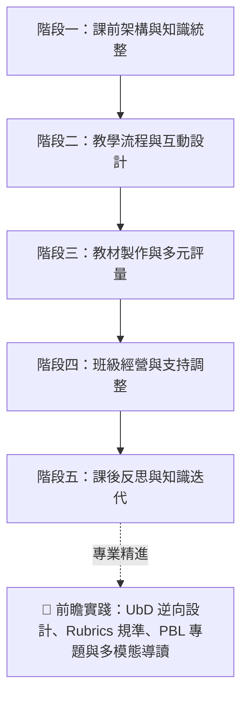

# Puti-AI | 素養導向 AI 備課實戰指南：從課程設計、多元評量到課後迭代的 39 個增能工作流

> **💡 教學科技核心思維：雙軌協同架構**
> * **通用對話型 AI（發散創意與架構大腦，如 ChatGPT / Claude / Gemini / Copilot）**：
>   擅長教學活動發想、多層次概念改寫、素養提問設計、UbD 逆向教案架構、親師溝通文案與日常行政生成。
> * **文件知識庫型 AI（精準依據與知識管理大腦，如 NotebookLM）**：
>   **專門處理特定依據任務**：100% 依據校本教材/長篇 PDF 提煉重點、跨版本教科書比對、特教學生 IEP 需求萃取、YouTube 影音轉化為學習單，以及生成雙人 AI 語音導讀音訊。

---

## 🧭 素養教學 AI 備課全景地圖



---

## 📑 目錄

- [一、課前架構與知識統整](#一課前架構與知識統整)
  - 01. 快速生成素養導向三維教學目標
  - 02. 長篇課綱與校本教材核心提煉【推薦文件知識庫 AI】
  - 03. 規劃單元分堂教學架構與進度表
  - 04. 跨版本教材對比與優點整合摘要【推薦文件知識庫 AI】
  - 05. 教育研究文獻與政策公文重點速讀【推薦文件知識庫 AI】
  - 06. 規劃教師每週備課與行政節奏清單
  - 07. 建立學期永續教學資源資料庫【推薦文件知識庫 AI】
  - 08. 產生學年共備高效研討提綱
  - 09. 共備研討筆記轉化為具體行動清單【推薦文件知識庫 AI】
- [二、教學流程與互動設計](#二教學流程與互動設計)
  - 10. 設計 5 分鐘課堂引起動機暖身活動
  - 11. 規劃分組分層的差異化課堂任務
  - 12. 設計由淺入深的三層次引導提問句
  - 13. 抽象概念的多層次與比喻式講解改寫
  - 14. 設計課室英語與雙語教學情境指令
  - 15. 閱讀文本分級化與階梯式鷹架調整 (Tiered Reading)
  - 16. 設計高層次探究思考與辯論題目
- [三、教材製作與多元評量](#三教材製作與多元評量)
  - 17. 草擬素養導向學習單與生活應用題
  - 18. 規劃視覺化教學簡報重點版面架構
  - 19. 產生情境引導與班級常規海報文案
  - 20. 規劃結構化板書佈局與概念思維圖
  - 21. 產生多元形成性評量題（含迷思概念誘答辨析）
  - 22. 設計課堂總結出門單 (Exit Ticket)
- [四、班級經營與個別支持](#四班級經營與個別支持)
  - 23. 全校研習與處室宣導重點轉化【推薦文件知識庫 AI】
  - 24. 撰寫親師溝通指引與開學通知信初稿
  - 25. 規劃開學第一堂課破冰話術與師生互動
  - 26. 制定正向引導的班級常規與激勵機制
  - 27. 設計特殊需求學生（ADHD/閱讀困難）課堂抽離與融合支持策略
  - 28. 萃取個別化教育計畫 (IEP) 課堂執行檢核清單【推薦文件知識庫 AI】
- [五、課後反思與知識迭代](#五課後反思與知識迭代)
  - 29. 語音零碎心得轉化為結構化教學反思日誌
  - 30. 整合實務經驗迭代升級為教案資產 2.0【推薦文件知識庫 AI】
- [🚀 六、前瞻實踐：教育理論與多模態增強模組](#-六前瞻實踐教育理論與多模態增強模組)
  - 31. UbD 重理解逆向課程設計（以終為始架構）
  - 32. 素養導向表現任務與 Rubrics 四級評量規準表
  - 33. PBL 專題導向學習與核心驅動問題 (Driving Question)
  - 34. 課堂遊戲化機制與沉浸式闖關任務
  - 35. 一鍵生成雙人 AI 語音播客導讀【NotebookLM 專屬功能】
  - 36. 批判性思維培養：AI 故意出錯偵錯法 (Spot the Errors)
  - 37. 自動化出題：Google 表單 (Forms) CSV 格式快速輸出
  - 38. 優質 YouTube 影音教材直接入庫萃取【NotebookLM 專屬功能】
  - 39. 個別化學期日常綜合評語與成長心態文字生成
- [🧠 七、教師高質量 Prompt 五星萬用架構](#-七教師高質量-prompt-五星萬用架構)
- [💡 教師 AI 工具選用決策速查表](#-教師-ai-工具選用決策速查表)

---

# 一、課前架構與知識統整

### 01. 快速生成素養導向三維教學目標
* **適用情境**：單元課程啟動前，撰寫教案或教學進度計畫。
* **核心價值**：對標核心素養，同步涵蓋認知（知識概念）、技能（實作探究）、情意（態度價值）。
* **通用 Prompt 模板**：
  > 「我正在規劃〔三年級〕〔自然科學〕單元：『〔磁鐵的性質與生活應用〕』。請依據素養導向教學原則，為我條列出本單元的：
  > 1. 知識目標（學生需掌握的核心科學原理與概念）
  > 2. 技能目標（學生能實際動手操作、記錄或驗證的探究技能）
  > 3. 情意目標（生活觀察態度、團隊合作或解決問題的素養）
  > 請以條列式輸出，每點具體明確，符合該年段認知發展水準。」

### 02. 長篇課綱與校本教材核心提煉【推薦文件知識庫 AI】
* **適用情境**：手邊有數十頁的新課綱課程指引、校本特色教材或出版社教學資源手冊。
* **核心價值**：100% 依據上傳文本精準歸納，杜絕 AI 憑空捏造，快速掌握學習重點與評量規準。
* **操作與提問範例**：
  > 「請根據上傳的校本課程指引與單元教材 PDF，為我萃取：
  > 1. 本單元對應的三大學習表現與學習內容代碼
  > 2. 學生在學習此單元時最容易出現的 2 個迷思概念
  > 3. 手冊中建議的關鍵教學活動與器材準備清單。」

### 03. 規劃單元分堂教學架構與進度表
* **適用情境**：學期初排課、整學期或跨週分堂節奏規劃（如 4 節課的進度分配）。
* **核心價值**：邏輯清晰搭建單元骨架（引入 $\rightarrow$ 展開 $\rightarrow$ 探究 $\rightarrow$ 評量統整）。
* **通用 Prompt 模板**：
  > 「請為〔五年級〕〔社會科〕『〔台灣的地形與生活發展〕』設計一份共 4 節課（每節 40 分鐘）的單元教學進度表。
  > 請以表格呈現，欄位包含：節次、單元子題、核心概念、教學活動流程（起承轉合）、評量方式與延伸課後探究。」

### 04. 跨版本教材對比與優點整合摘要【推薦文件知識庫 AI】
* **適用情境**：備課時手邊有兩到三個不同出版社版本，想截長補短。
* **核心價值**：快速進行跨文本比對，找出共同核心並吸取各家範例優點。
* **操作與提問範例**：
  > 「我已上傳 A、B 兩家出版社同一單元的教科書章節。請為我分析：
  > 1. 兩版本在『概念引入案例』與『實驗活動安排』上的主要差異
  > 2. 兩者共同的核心概念重點
  > 3. 請融合兩版優點，提供一份適合班級教學的統整式學習摘要。」

### 05. 教育研究文獻與政策公文重點速讀【推薦文件知識庫 AI】
* **適用情境**：研讀長篇教學法論文、跨領域專案指引或教育局評鑑公文。
* **核心價值**：附帶精確引文出處，長文快速萃取行動指引。
* **提問範例**：
  > 「請根據上傳的『跨領域素養導向評量研究報告』，摘要出：
  > 1. 評量設計的 4 大核心原則
  > 2. 報告中提到的 2 個課堂實施成功案例
  > 3. 教師在命題時應避免的常見偏誤，並標註引文頁碼。」

### 06. 規劃教師每週備課與行政節奏清單
* **適用情境**：開學前夕或每週五下午，安排下一週的教學與行政節奏。
* **通用 Prompt 模板**：
  > 「請為一位國小導師規劃週一至週五的『一週高效備課與班級行政清單』。
  > 每天需聚焦一項核心主軸（例如：週一引起動機設計、週二教材簡報調整、週三學習單編寫、週四差異化作業、週五評量檢核與親師週報），以 Markdown 檢核框（- [ ]）格式呈現。」

### 07. 建立學期永續教學資源資料庫【推薦文件知識庫 AI】
* **適用情境**：開學前建立專屬學科知識庫 Notebook，集中管理整學期的素材與教案。
* **操作心法**：統一資料夾與筆記命名，隨時將優質教案、反思筆記固定（Pin）為來源，隨時呼叫與生成新教材。

### 08. 產生學年共備高效研討提綱
* **適用情境**：擔任學年共備召集人，需在有限時間（40~50 分鐘）內帶領團隊聚焦。
* **通用 Prompt 模板**：
  > 「我們學年預計進行〔四年級〕〔國語科〕『〔說明文閱讀理解策略〕』的共備會議（時間 45 分鐘）。
  > 請設計一份結構化的共備討論提綱，包含：
  > 1. 單元學習難點與迷思確認（10分鐘）
  > 2. 核心教學策略與共備活動發想（20分鐘）
  > 3. 跨班分工與評量工具設計（15分鐘）。」

### 09. 共備研討筆記轉化為具體行動清單【推薦文件知識庫 AI】
* **適用情境**：共備會議結束後，將大家的發言摘要或逐字紀錄轉為可執行的分工表。
* **提問範例**：
  > 「根據今天學年共備的研討紀錄筆記，請整理出：
  > 1. 今日達成的三項教學共識
  > 2. 各班級老師的分工事項與繳交期限表格（包含：教具準備、學習單編寫、簡報製作）
  > 3. 下次共備需帶來的課堂實施成果。」

---

# 二、教學流程與互動設計

### 10. 設計 5 分鐘課堂引起動機暖身活動
* **適用情境**：課堂一開始，讓學生快速沉澱並聚焦在今日主題。
* **通用 Prompt 模板**：
  > 「教學主題是『〔生活中的熱傳導與保溫〕』，對象為〔小學五年級〕。
  > 請設計 3 個不同形式、可在 3~5 分鐘內完成的課堂破冰暖身活動（例如：日常現象猜謎、3-2-1 快速提問法、實物圖片聯想），需能有效引發好奇心且操作簡便。」

### 11. 規劃分組分層的差異化課堂任務
* **適用情境**：班級學生先備知識與理解速度差異大時，實施分層教學。
* **通用 Prompt 模板**：
  > 「針對『〔分數的乘法與面積模型〕』概念，請設計兩組不同梯度的課堂練習任務：
  > 1. 【基礎組（鷹架支持）】：著重圖形塗色分割、具體物操作與基本公式對應。
  > 2. 【挑戰組（深度延伸）】：著重生活情境題解構、逆向思考與文字題改編。
  > 請分別說明任務目標與教師引導語。」

### 12. 設計由淺入深的三層次引導提問句
* **適用情境**：備課時撰寫提問講稿，引導課堂討論逐步深化。
* **通用 Prompt 模板**：
  > 「請針對『〔台灣高鐵與一日生活圈的形成〕』主題，設計三個層次分明的引導式課堂提問：
  > 1. 【事實與理解層次】：確認基礎事實（如：高鐵站點與交通時間變化）。
  > 2. 【分析與推論層次】：探討因果關係（如：交通革新對城鄉經濟與生活形態的影響）。
  > 3. 【評鑑與創造層次】：開放式決策思維（如：如果你是城市規劃師，你會如何改善偏鄉交通？）。」

### 13. 抽象概念的多層次與比喻式講解改寫
* **適用情境**：抽象科學或社會概念難以理解時，提供多種比喻說法。
* **通用 Prompt 模板**：
  > 「請將『〔生態系中的食物鏈與能量流動〕』概念改寫為三種不同理解層次的說明講稿：
  > 1. 【低年段/生活比喻版】：運用『工廠輸送帶』或『餐廳傳菜』的生活化譬喻。
  > 2. 【標準課堂版】：適合中高年級的清晰概念講解。
  > 3. 【延伸專業版】：適合資優或課後探究的生態金字塔與能量守恆補充。」

### 14. 設計課室英語與雙語教學情境指令
* **適用情境**：雙語綜合、雙語美勞或雙語體育課堂中的日常指導。
* **通用 Prompt 模板**：
  > 「我正在規劃一堂〔雙語體育課：籃球基本運球與傳球〕。請提供 8 句最常用的課堂口語指令（如：請排成四行、注意聽哨音、跟你的隊友擊掌、把球收在腰間），格式包含：繁體中文、自然地道的英語表達、發音與重音提示。」

### 15. 閱讀文本分級化與階梯式鷹架調整 (Tiered Reading)
* **適用情境**：提供給不同閱讀能力的學生相同主題但不同難度的閱讀文本。
* **通用 Prompt 模板**：
  > 「請將以下這段關於『〔台灣特有種台灣黑熊的生態保育〕』的介紹短文，改寫成三種難度梯度版本：
  > 【入門版】：字句簡短、標註重點詞彙並搭配簡單是非檢核題。
  > 【標準版】：完整記敘論述，搭配概念問答。
  > 【進階版】：加入保育衝突數據分析，引導撰寫短評。」

### 16. 設計高層次探究思考與辯論題目
* **適用情境**：高年級專題探究、議題討論或班級辯論會。
* **通用 Prompt 模板**：
  > 「主題為『〔一次性塑膠用品禁用與生活便利的權衡〕』。請為國小高年級設計 2 個結構化的課堂辯論或探究題目，並附帶：正反雙方可能主張的 3 個核心論點、以及引導學生尋找支持證據的引導問題。」

---

# 三、教材製作與多元評量

### 17. 草擬素養導向學習單與生活應用題
* **適用情境**：設計單元課堂即時檢測或課後自主探究學習單。
* **通用 Prompt 模板**：
  > 「請為〔四年級〕〔生活數學〕單元『〔統計圖表與生活消費〕』設計一份 1 頁 A4 的學習單架構：
  > 包含：
  > 1. 情境引入題（以校園園遊會記帳為背景）
  > 2. 圖表判讀與計算題 2 題
  > 3. 一題開放式生活實踐題（規劃一份 100 元的合理點心預算）。」

### 18. 規劃視覺化教學簡報重點版面架構
* **適用情境**：製作教學簡報（PPT / Canva）前，先提煉純文字重點，避免簡報字數過多。
* **通用 Prompt 模板**：
  > 「我需要製作 5 頁關於『〔地震的成因與避難三步驟〕』的教學簡報。請為每頁規劃：
  > 1. 簡報核心標題
  > 2. 視覺化重點文字（每頁不超過 3 點，每點在 15 字以內）
  > 3. 建議搭配的示意插圖或圖表說明。」

### 19. 產生情境引導與班級常規海報文案
* **適用情境**：教室佈置、學習角落指引或習慣養成標語。
* **通用 Prompt 模板**：
  > 「請為班級的『〔自主學習探究角〕』設計一套情境海報文案：
  > 包含：吸睛主題標題、4 條正向好記的行動公約（短句）、以及一句激勵自主探索的班級口號。」

### 20. 規劃結構化板書佈局與概念思維圖
* **適用情境**：上課前預先規劃黑板板書，讓課堂重點一目了然。
* **通用 Prompt 模板**：
  > 「針對『〔植物各部位的構造與功能（根莖葉花果種）〕』，請為我設計一份黑板板書架構圖。請用文字符號（如 `├──`、`→`、`[框]`）展現黑板左中右分區佈局與核心概念層次。」

### 21. 產生多元形成性評量題（含迷思概念誘答辨析）
* **適用情境**：隨堂隨選測驗、即時反饋系統（如 Kahoot/Quizizz）命題。
* **通用 Prompt 模板**：
  > 「請針對『〔光線的直進、反射與折射〕』為〔五年級〕設計 4 題單選題。每題需提供：正確答案、詳細解析，以及針對 3 個錯誤選項分別說明其背後反映的學生迷思概念。」

### 22. 設計課堂總結出門單 (Exit Ticket)
* **適用情境**：下課前 3 分鐘快速檢視全班今日學習吸收狀況。
* **通用 Prompt 模板**：
  > 「請為今日課堂主題『〔小數的除法運算〕』設計一份可在 3 分鐘內作答完畢的極簡版 Exit Ticket（出門單）：
  > 包含：
  > 1. 今日核心概念檢核題 1 題
  > 2. 一個我今天最清楚的觀念
  > 3. 一個我還想進一步搞懂的疑問。」

---

# 四、班級經營與個別支持

### 23. 全校研習與處室宣導重點轉化【推薦文件知識庫 AI】
* **適用情境**：開學前夕處理大量處室宣導文件、研習逐字稿與校務行事曆。
* **提問範例**：
  > 「根據上傳的開學前全體教師研習資料，請幫我整理出：
  > 1. 與導師班級經營直接相關的關鍵日程與表單繳交死線
  > 2. 新學期學生出缺勤與請假通報規範變更
  > 3. 校園偶發事件處理標準作業流程（SOP）。」

### 24. 撰寫親師溝通指引與開學通知信初稿
* **適用情境**：開學給家長的一封信、班級作息通知與親師合作手冊。
* **通用 Prompt 模板**：
  > 「請為一位國小導師撰寫『開學給家長的一封信』。語氣需展現專業、溫暖、親切且條理分明。
  > 內容包含：
  > 1. 歡迎詞與班級教育核心理念
  > 2. 開學常規與學童必備文具生活用品提醒
  > 3. 親師溝通方式與最佳聯絡時段守則。」

### 25. 規劃開學第一堂課破冰話術與師生互動
* **適用情境**：接任新班級的第一堂課，建立良好的師生連結與親和力。
* **通用 Prompt 模板**：
  > 「我是一位新接手〔四年級〕班級的導師。請幫我設計開學第一堂課的 3 分鐘自我介紹與破冰開場講稿，並設計一個 5 分鐘能引導全班參與的『尋找共同點』快速互動小遊戲。」

### 26. 制定正向引導的班級常規與激勵機制
* **適用情境**：制定民主且富童趣的班級公約與加分機制。
* **通用 Prompt 模板**：
  > 「請將生硬負面的班規要求（如：不要吵鬧、不要亂丟垃圾、不要遲到），轉化為 5 條以正面積極語言表述的『班級冒險家守則』，並搭配一套具體可行、強調合作榮譽的點數獎勵機制。」

### 27. 設計特殊需求學生（ADHD/閱讀困難）課堂學習支持策略
* **適用情境**：班上有注意力不足過動 (ADHD) 或閱讀障礙學生時，規劃課堂通用調整。
* **通用 Prompt 模板**：
  > 「班上有一位容易在聽講時分心、書寫速度較慢的三年級學生。請提供 4 個可在普通班課堂中自然落實的個別化學習支持策略（例如：視覺檢核卡、分段指引、同儕小天使分工、多元作答形式）。」

### 28. 萃取個別化教育計畫 (IEP) 課堂執行檢核清單【推薦文件知識庫 AI】
* **適用情境**：閱讀特教轉移的 IEP 個案資料，提煉課堂現場必備支援。
* **提問範例**：
  > 「請從這份 IEP 文件中，精準摘錄出普通班導師在日常教學中需落實的：
  > 1. 課堂座位安排與環境調整建議
  > 2. 情緒波動時的正向應對步驟
  > 3. 定期評量時的調整措施（如延長時間、報讀支援）。」

---

# 五、課後反思與知識迭代

### 29. 語音零碎心得轉化為結構化教學反思日誌
* **適用情境**：下課後透過手機語音輸入零碎觀察，自動轉化為專業反思。
* **通用 Prompt 模板**：
  > 「這是我今天上完『〔科學浮力實驗〕』後的隨手語音筆記：『今天時間掌控有點趕，最後各組收拾器材太混亂；但第二組發現沉下去的黏土捏成船型就能浮起來，全班反應很棒，下次應該讓他們多分享這段...』
  > 請幫我將上述雜記整理為專業的教學反思日誌：
  > 1. 本堂教學亮點與成功策略
  > 2. 遭遇問題與原因剖析
  > 3. 下次教學優化的具體改善行動（Action Items）。」

### 30. 整合實務經驗迭代升級為教案資產 2.0【推薦文件知識庫 AI】
* **適用情境**：單元結束或學期末，將整學期的反思筆記與原教案整合成永續教材。
* **提問範例**：
  > 「請比對資料庫中的『原始教學教案』與本學期的『課後反思筆記』，為我生成一份『優化升級版教案 2.0』，特別標註活動流程調整處、時間分配改善建議以及新增的學生迷思提醒。」

---

# 🚀 六、前瞻實踐：教育理論與多模態增強模組

> 整合 UbD 逆向設計、素養表現規準、PBL 跨域探究、課堂遊戲化與 AI 多模態功能。

### 31. UbD 重理解逆向課程設計（以終為始架構）
* **適用情境**：公開授課、大型主題統整單元或校訂課程教案設計。
* **核心思維**：先確認「預期學習結果」$\rightarrow$ 決定「評量證據」$\rightarrow$ 再規劃「學習體驗」。
* **通用 Prompt 模板**：
  > 「請依據 UbD（Understanding by Design）逆向設計架構，為〔六年級〕〔社會/自然跨領域〕主題『〔氣候變遷與在地水資源保護〕』規劃一份單元教案架構：
  > 1. 【階段一：預期學習結果】：核心概念（Big Ideas）、本質問題（Essential Questions）、核心素養指標。
  > 2. 【階段二：評量證據】：真實情境表現任務（GRASPS 模型）、多元檢核方式。
  > 3. 【階段三：學習計畫】：符合 WHERETO 架構的教學歷程設計。」

### 32. 素養導向表現任務與 Rubrics 四級評量規準表
* **適用情境**：實作評量、專題探究成果、小組海報發表的客觀評分。
* **通用 Prompt 模板**：
  > 「學生需完成一項表現任務：『〔為社區設計一份防汛避難宣導圖卡〕』。
  > 請為此任務設計一份評量規準表（Rubric），包含：
  > - 評量向度（如：資訊正確性、視覺版面傳達、問題解決洞察、團隊發表）。
  > - 表現層級：4 級（優異表現）、3 級（符合標準）、2 級（接近標準）、1 級（需要協助），每個欄位需有具體可觀察的描述指標。」

### 33. PBL 專題導向學習與核心驅動問題 (Driving Question)
* **適用情境**：彈性學習節數、SDGs 永續議題探究。
* **通用 Prompt 模板**：
  > 「我們要為〔五年級〕規劃一個為期 6 週的 PBL 專題：『〔改善校園落葉堆肥與環境美化〕』。
  > 請提供：
  > 1. 一個具挑戰性且貼近學生生活的【核心驅動問題（Driving Question）】
  > 2. 跨學科知識整合點（自然分解原理、數學面積測量、語文倡議文案）
  > 3. 最終向全校師生發表的【公開成果形式（Public Product）】建議。」

### 34. 課堂遊戲化機制與沉浸式闖關任務
* **適用情境**：單元總複習、期末闖關活動，提升學習投入度。
* **通用 Prompt 模板**：
  > 「請將〔四年級數學〕『〔幾何圖形與周長面積〕』複習課程，改編成一個沉浸式闖關任務：『〔失落王國的幾何密碼〕』。
  > 需包含：
  > 1. 任務背景情境與角色引導
  > 2. 三道不同挑戰梯度的關卡（基礎操作關、生活解謎關、終極大魔王挑戰）
  > 3. 小組合作計分與榮譽勳章機制。」

### 35. 一鍵生成雙人 AI 語音播客導讀【NotebookLM 專屬功能】
* **適用情境**：製作學生課前預習音訊、無障礙聽覺教材、教師通勤共備導讀。
* **操作與自訂 Prompt 範例**：
  1. 將單元科普教材或文獻上傳至 NotebookLM。
  2. 點擊面板上的 **「Audio Overview（音訊對話）」** $\rightarrow$ 自訂提示詞：
     > 「請以兩位生動有趣的科普主持人風格，針對小學四年級聽眾，用口語對話的方式深入淺出解釋這份教材中的『生活中的熱傳遞與保溫原理』，多使用生活化比喻，時間約 5 分鐘。」
  3. 下載產生的音檔供學生隨選聆聽。

### 36. 批判性思維培養：AI 故意出錯偵錯法 (Spot the Errors)
* **適用情境**：培養學生概念精熟與辨析批判能力。
* **通用 Prompt 模板**：
  > 「請根據『〔物質受熱膨脹與熱脹冷縮〕』概念，撰寫一篇 250 字的學生生活短文。
  > 請在文章中故意埋入 3 個常見的科學觀念迷思（例如：誤以為熱脹冷縮是物體質量變重）。
  > 請在文末附上【教師專用偵錯答案與課堂提問引導清單】。」

### 37. 自動化出題：Google 表單 (Forms) CSV 格式快速輸出
* **適用情境**：快速建構線上隨堂測驗，避免一題題手動複製貼上。
* **通用 Prompt 模板**：
  > 「請針對〔五年級自然〕『〔太陽與影子變化〕』設計 5 題單選題。
  > 請直接以標準 CSV 格式輸出，欄位包含：『題目內容, 選項A, 選項B, 選項C, 選項D, 正確答案, 解析說明』，以利我直接匯入試算表與表單外掛。」

### 38. 優質 YouTube 影音教材直接入庫萃取【NotebookLM 專屬功能】
* **適用情境**：找到優質的歷史或科學 YouTube 影片，快速轉化為學習引導單。
* **操作與提問範例**：
  1. 在 NotebookLM 點擊「新增來源」 $\rightarrow$ 選擇「YouTube」貼上影片連結。
  2. **提問範例**：
     > 「請根據這部 10 分鐘的科普影音字幕，整理出：
     > 1. 影片說明的 3 大核心概念
     > 2. 設計 3 題學生在觀看時需邊看邊記錄的『觀影導引思考題』。」

### 39. 個別化學期日常綜合評語與成長心態文字生成
* **適用情境**：期末撰寫學生成績單評語、綜合表現紀錄。
* **通用 Prompt 模板**：
  > 「請為國小學生撰寫期末成績單的『日常綜合表現評語』（字數約 80~100 字）。
  > 語氣需溫暖肯定、具體且富含成長心態（Growth Mindset）。
  > 學生表現特質：【熱心服務、自然實驗探究敏銳、小組討論積極，但個人數學書寫時偶有粗心漏題】。
  > 請提供 2 種不同語氣風格（溫暖親切風 / 條理激勵風）供我選擇。」

---

# 🧠 七、教師高質量 Prompt 五星萬用架構

> 掌握 5 大核心要素，任何提示詞套用此公式，生成品質提升 80%：

$$\text{高品質教學 Prompt} = \text{角色 (Role)} + \text{任務 (Task)} + \text{對象 (Target)} + \text{情境脈絡 (Context)} + \text{格式限制 (Constraints)}$$

```markdown
1. 【角色 (Role)】：你是一位擁有 15 年國小教學經驗的自然專任教師與課程設計專家...
2. 【任務 (Task)】：請為我設計一堂 40 分鐘的『磁鐵性質探究』教案...
3. 【對象 (Target)】：學習對象為國小三年級學生，先備知識已知磁鐵能吸鐵...
4. 【情境脈絡 (Context)】：教室配備平板與分組實驗器材，採 4 人小組合作學習...
5. 【格式限制 (Constraints)】：請以 Markdown 表格呈現時間分配、教師提問、學生活動與評量指標，文字具體簡明，避免空洞理論。
```

---

## 💡 教師 AI 工具選用決策速查表

| 備課任務類型 | 推薦工具屬性 | 常用工具代表 | 選擇理由與時機 |
| :--- | :---: | :---: | :--- |
| **發想新活動、文案、提問、題庫** | **通用對話型 AI** | ChatGPT / Claude / Gemini / Copilot | 發散思考強、文筆自然、可隨意指定語氣與分層難度 |
| **研讀長篇課綱、教科書指引、論文** | **文件知識庫型 AI** | NotebookLM | 100% 依據上傳文本回答，附帶頁碼段落，零幻覺 |
| **YouTube 影音直接轉學習單與導引題** | **文件知識庫型 AI** | NotebookLM | 支援直接貼上 YouTube 連結，自動精準萃取影音逐字稿 |
| **一鍵將教材生成雙人語音對話播客** | **文件知識庫型 AI** | NotebookLM | 獨創 Audio Overview 功能，一鍵多模態音訊生成 |
| **UbD 逆向教案 / Rubrics 規準表 / PBL 探究** | **通用對話型 AI** | ChatGPT / Claude / Gemini / Copilot | 邏輯架構化能力極佳，能精準對標各類教學理論規範 |
| **家長信、情境標語、期末個別化評語** | **通用對話型 AI** | ChatGPT / Claude / Gemini / Copilot | 語境掌握度佳，支援多語言、成長心態與細膩修飾 |
| **Google 表單快速出題 (CSV 格式)** | **通用對話型 AI** | ChatGPT / Claude / Gemini / Copilot | 支援特定表格與程式格式輸出，方便匯入表單系統 |
| **共備錄音檔/會議紀錄/IEP 重點萃取** | **文件知識庫型 AI** | NotebookLM | 善於多文檔整合比對，精準歸納待辦行動 |
| **學期末教案反思與迭代升級** | **雙軌協同** | 知識庫 AI $\rightarrow$ 通用對話 AI | 知識庫 AI 整合歷史反思 $\rightarrow$ 通用對話 AI 重新潤飾新教案 |

---

屏東縣後庄國小黃朝榮老師作品，免費分享，歡迎擴散推廣，嚴禁商用與任何侵權、不尊重著作權的行為，更多 Puti-AI 教學工具 點此前往(https://padlet.com/clongwh/puti_ai_tools)
