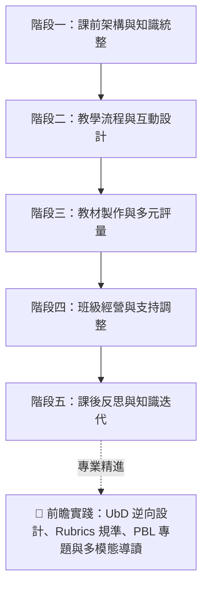

# Puti-AI | 素養導向 AI 備課實戰指南：從課程設計、多元評量到課後迭代的 36 個增能工作流

> **💡 教學科技核心思維：雙軌協同架構**
> * **通用對話型 AI（發散創意與架構大腦，如 ChatGPT / Claude / Gemini / Copilot）**：
>   擅長教學活動發想、多層次概念改寫、素養提問設計、UbD 逆向教案架構、親師溝通文案與日常行政生成。
> * **文件知識庫型 AI（精準依據與知識管理大腦，如 NotebookLM）**：
>   **專門處理特定依據任務**：以指定校本教材/長篇 PDF 提煉重點、跨版本教科書比對、特教學生 IEP 需求萃取、YouTube 影音轉化為學習單，以及生成雙人對話導讀腳本。

---

## 🧭 素養教學 AI 備課全景地圖



---

## 📑 目錄

- [一、課前架構與知識統整](#一課前架構與知識統整)
  - 01. 生成「目標—活動—評量」三位一體完整教案骨架
  - 02. 長篇課綱與校本教材重點萃取【推薦文件知識庫 AI】
  - 03. 規劃單元分堂教學架構與進度表
  - 04. 跨版本教材比對與融合統整教案【推薦文件知識庫 AI】
  - 05. 教育文獻與政策公文轉教師行動指引【推薦文件知識庫 AI】
  - 06. 產生學年共備研討提綱與分工產出表
  - 07. 共備研討紀錄轉化為具體行動清單【推薦文件知識庫 AI】
- [二、教學流程與互動設計](#二教學流程與互動設計)
  - 08. 設計 5 分鐘課堂引起動機暖身活動
  - 09. 規劃三層級差異化任務與鷹架指引
  - 10. 設計三層次課堂提問、預期回答與追問話術
  - 11. 抽象概念的多層次比喻講解與迷思檢核
  - 12. 設計課室英語與雙語教學情境指令
  - 13. 閱讀文本分級化與階梯式鷹架調整 (Tiered Reading)
  - 14. 設計高層次探究思考與辯論題目
- [三、教材製作與多元評量](#三教材製作與多元評量)
  - 15. 生成可直接列印的素養學習單與教師解答卷
  - 16. 規劃簡報重點頁架構與學生認知負荷檢核
  - 17. 板書版面佈局、提問節點與學生筆記指引
  - 18. 產生多元形成性評量題（含迷思概念誘答辨析）
  - 19. Exit Ticket 出門單與下一步補救教學策略
- [四、班級經營與個別支持](#四班級經營與個別支持)
  - 20. 全校研習與處室宣導重點轉化行動清單【推薦文件知識庫 AI】
  - 21. 撰寫客製化親師溝通信與開學通知初稿
  - 22. 開學第一堂課 40 分鐘完整流程與默契建立
  - 23. 班級民主共訂公約流程與正向行為支持機制
  - 24. 特殊需求生課堂支持策略（普通班融合實務）
  - 25. 萃取個別化教育計畫 (IEP) 課堂執行檢核清單【推薦文件知識庫 AI】
- [五、課後反思與知識迭代](#五課後反思與知識迭代)
  - 26. 語音零碎心得轉化為結構化教學反思日誌
  - 27. 整合實務經驗迭代升級為教案資產 2.0【推薦文件知識庫 AI】
- [🚀 六、前瞻實踐：教育理論與多模態增強模組](#-六前瞻實踐教育理論與多模態增強模組)
  - 28. UbD 重理解逆向課程設計（以終為始架構）
  - 29. 素養導向表現任務與 Rubrics 四級評量規準表
  - 30. PBL 6 週專題導向學習全流程規劃
  - 31. 課堂遊戲化機制、闖關任務與安全替代方案
  - 32. 雙人對話式科普導讀腳本（語音教材生成）
  - 33. 批判性思維：AI 故意出錯偵錯法 (Spot the Errors)
  - 34. Google 表單 (Forms) 標準 CSV 格式快速出題
  - 35. YouTube 優質影音轉觀影導引單與時間戳記【推薦文件知識庫 AI】
  - 36. 基於客觀觀察紀錄的學期評語與成長心態文字
- [🧠 七、教師高質量 Prompt 五星萬用架構](#-七教師高質量-prompt-五星萬用架構)
- [💡 教師 AI 工具選用決策速查表](#-教師-ai-工具選用決策速查表)

---

# 一、課前架構與知識統整

### 01. 生成「目標—活動—評量」三位一體完整教案骨架
* **適用情境**：單元備課起手式，一次建立可觀察目標、流程與評量對齊的教案。
* **核心價值**：避免目標與活動割裂，產出可直接貼入教學計畫書的標準 Markdown 表格。
* **通用 Prompt 模板**：
  > 「我正在規劃〔三年級〕〔自然科學〕單元：『〔磁鐵的性質與生活應用〕』，教學時間共 40 分鐘。
  > 請為我產出一份「目標—活動—評量」高度對齊的完整教案骨架，需包含：
  > 1. 【三維學習目標】：可具體觀察檢核的認知（概念）、技能（探究操作）、情意（態度價值）指標。
  > 2. 【教學歷程表格】：包含時間分配（引起動機 5m、發展活動 25m、總結評量 10m）、教師關鍵引導提問、學生活動任務與具體操作。
  > 3. 【評量證據】：對應各階段的形成性檢核方式（如口語發表、實作成品、學習單記錄）。
  > 4. 【差異化支持策略】：針對學習落後與超前學生的即時課堂調整方案。」

### 02. 長篇課綱與校本教材重點萃取【推薦文件知識庫 AI】
* **適用情境**：手邊有數十頁的課程指引、校本特色教材或教學手冊 PDF。
* **核心價值**：以指定教材為主要依據，快速萃取學習表現、迷思概念與器材清單。
* **操作與提問範例**：
  > 「請根據上傳的校本課程指引與單元教材 PDF，為我萃取：
  > 1. 本單元對應的三大學習表現與學習內容代碼
  > 2. 學生在學習此單元時最容易出現的 2 個迷思概念
  > 3. 手冊中建議的關鍵教學活動與器材準備清單。」

### 03. 規劃單元分堂教學架構與進度表
* **適用情境**：學期初排課、跨週分堂節奏規劃（如 4 節課的進度分配）。
* **核心價值**：邏輯清晰搭建單元骨架（引入 $\rightarrow$ 展開 $\rightarrow$ 探究 $\rightarrow$ 評量統整）。
* **通用 Prompt 模板**：
  > 「請為〔五年級〕〔社會科〕『〔台灣的地形與生活發展〕』設計一份共 4 節課（每節 40 分鐘）的單元教學進度表。
  > 請以表格呈現，欄位包含：節次、單元子題、核心概念、教學活動流程（起承轉合）、評量方式與延伸課後探究。」

### 04. 跨版本教材比對與融合統整教案【推薦文件知識庫 AI】
* **適用情境**：備課時手邊有兩到三個不同版本教科書，欲截長補短產出統整教案。
* **核心價值**：分析各版本引入案例與實驗優劣，直接生成融合最佳實踐的新教案。
* **操作與提問範例**：
  > 「我已上傳 A、B 兩家出版社同一單元的教科書章節 PDF。請為我分析：
  > 1. 【版本比對】：兩版本在「概念引入案例」與「活動安排」上的優缺點比較。
  > 2. 【共同核心】：兩版本共同的核心概念與評量重點。
  > 3. 【統整教案】：請截取 A 版的生動情境引入，結合 B 版嚴謹的實驗步驟，產出一份最適合課堂實施的融合版單元教案。」

### 05. 教育文獻與政策公文轉教師行動指引【推薦文件知識庫 AI】
* **適用情境**：研讀長篇教學法論文、跨領域專案指引或公文評鑑指標。
* **核心價值**：附帶精確引文出處與頁碼，長文快速萃取具體行動方針。
* **提問範例**：
  > 「請根據上傳的『跨領域素養導向評量研究報告』，摘要出：
  > 1. 評量設計的 4 大核心原則
  > 2. 報告中提到的 2 個課堂實施成功案例
  > 3. 教師在命題時應避免的常見偏誤，並標註引文頁碼。」

### 06. 產生學年共備研討提綱與分工產出表
* **適用情境**：擔任學年共備召集人，需在 45 分鐘內達成決策並分派產出。
* **核心價值**：明確劃分研討時間配比，產出具體責任分工與成果檢核表。
* **通用 Prompt 模板**：
  > 「我們學年預計進行〔四年級〕〔國語科〕『〔說明文閱讀理解策略〕』的共備會議（時間 45 分鐘）。
  > 請設計一份包含決策流程的結構化共備提綱：
  > 1. 【難點共識（10分鐘）】：確認本課學生三大閱讀理解卡點與迷思。
  > 2. 【策略聚焦（20分鐘）】：討論並拍板共備核心教學活動（如心智圖拆解/段落重組）。
  > 3. 【具體分工產出表（15分鐘）】：產出表格，包含：教材簡報、分層學習單、隨堂測驗題之負責教師欄位、繳交期限與檢驗規準。」

### 07. 共備研討紀錄轉化為具體行動清單【推薦文件知識庫 AI】
* **適用情境**：共備會議結束後，將發言紀錄轉為可執行的分工表。
* **核心價值**：自動歸納教學共識、負責人欄位與下次共備準備事項。
* **提問範例**：
  > 「根據今天學年共備的研討紀錄筆記，請整理出：
  > 1. 今日達成的三項教學共識
  > 2. 各班級老師的分工事項與繳交期限表格（包含：教具準備、學習單編寫、簡報製作）
  > 3. 下次共備需帶來的課堂實施成果。」

---

# 二、教學流程與互動設計

### 08. 設計 5 分鐘課堂引起動機暖身活動
* **適用情境**：課堂一開始，讓學生快速沉澱並聚焦在今日主題。
* **核心價值**：提供猜謎、3-2-1 快速提問法、圖片聯想等多種破冰形式。
* **通用 Prompt 模板**：
  > 「教學主題是『〔生活中的熱傳導與保溫〕』，對象為〔小學五年級〕。
  > 請設計 3 個不同形式、可在 3~5 分鐘內完成的課堂破冰暖身活動（例如：日常現象猜謎、3-2-1 快速提問法、實物圖片聯想），需能有效引發好奇心且操作簡便。」

### 09. 規劃三層級差異化任務與鷹架指引
* **適用情境**：針對班級學生能力落差，設計基礎、進階、挑戰三層級課堂任務。
* **核心價值**：提供各組清晰的任務卡、提示鷹架與教師走動引導語。
* **通用 Prompt 模板**：
  > 「針對『〔分數的乘法與面積模型〕』概念，請為〔四年級〕設計三層級的差異化課堂任務：
  > 1. 【Level 1 基礎組（需要鷹架）】：圖形塗色分割、具體物操作引導與逐步計算步驟卡。
  > 2. 【Level 2 標準組（熟練應用）】：標準生活情境題解構與小組互相命題解題。
  > 3. 【Level 3 挑戰組（深度延伸）】：反向逆推問題（如：給定剩餘面積求原始長寬）與生活消費優化探究。
  > 請為每組提供具體任務說明、學生任務卡文案與教師巡堂引導提問。」

### 10. 設計三層次課堂提問、預期回答與追問話術
* **適用情境**：備課時撰寫提問講稿，預想學生可能回答並準備鷹架追問。
* **核心價值**：避免課堂冷場或卡關，精準引導學生從事實走向高階思考。
* **通用 Prompt 模板**：
  > 「請針對『〔台灣高鐵與一日生活圈的形成〕』主題，設計三個層次分明的引導式課堂提問：
  > 1. 【事實與理解層次】：提問句 + 預期學生回答 + 若學生答不出時的提示語。
  > 2. 【分析與推論層次】：提問句 + 預期學生回答 + 深化思考的「追問話術（Probing Question）」。
  > 3. 【評鑑與創造層次】：開放式決策提問（如城鄉發展與偏鄉交通資源權衡）+ 引導正反辯證的討論引導語。」

### 11. 抽象概念的多層次比喻講解與迷思檢核
* **適用情境**：抽象科學或社會概念難以理解時，提供多種比喻說法。
* **核心價值**：生成生活比喻版、標準課堂版，並附帶迷思診斷問題。
* **通用 Prompt 模板**：
  > 「請將『〔生態系中的食物鏈與能量流動〕』概念改寫為三種不同理解層次的說明講稿：
  > 1. 【生活比喻版】：運用『工廠輸送帶』或『餐廳傳菜』的生活化譬喻（適合需要具體形象的學生）。
  > 2. 【標準課堂版】：適合中高年級的清晰概念講解。
  > 3. 【迷思檢核題】：設計 2 道口語檢核題，快速診斷學生是否誤以為「能量可以 100% 傳遞給下一層消費者」。」

### 12. 設計課室英語與雙語教學情境指令
* **適用情境**：雙語綜合、美勞或體育課堂中的日常指導。
* **核心價值**：提供中文、地道英文句型與口語發音/重音提示。
* **通用 Prompt 模板**：
  > 「我正在規劃一堂〔雙語體育課：籃球基本運球與傳球〕。請提供 8 句最常用的課堂口語指令（如：請排成四行、注意聽哨音、跟你的隊友擊掌、把球收在腰間），格式包含：繁體中文、自然地道的英語表達、發音與重音提示。」

### 13. 閱讀文本分級化與階梯式鷹架調整 (Tiered Reading)
* **適用情境**：輸入指定原文，自動產出入門、標準、進階三種閱讀難度文本。
* **核心價值**：分層閱讀，兼顧各程度學童成就感。
* **通用 Prompt 模板**：
  > 「【原始文本輸入】：
  > [請貼上欲分級的原始閱讀文本，例如一段 300 字的台灣黑熊生態保育介紹]
  > 
  > 請將上述文本改寫為三個不同閱讀難度的梯次版本：
  > 【Level 1 入門版（初階閱讀）】：簡化句型與生難詞、標註重點關鍵字，並附 2 題是非題檢核理解。
  > 【Level 2 標準版（中年級適用）】：保留完整段落因果結構，附 2 題概念問答題。
  > 【Level 3 進階版（高年級/挑戰）】：融入生態衝突與數據比較，附 1 題開放式短評寫作引導。」

### 14. 設計高層次探究思考與辯論題目
* **適用情境**：高年級專題探究、時事議題討論或班級辯論會。
* **核心價值**：結構化產出正反論點與引導學生尋找證據的關鍵問題。
* **通用 Prompt 模板**：
  > 「主題為『〔一次性塑膠用品禁用與生活便利的權衡〕』。請為國小高年級設計 2 個結構化的課堂辯論或探究題目，並附帶：正反雙方可能主張的 3 個核心論點、以及引導學生尋找支持證據的引導問題。」

---

# 三、教材製作與多元評量

### 15. 生成可直接列印的素養學習單與教師解答卷
* **適用情境**：需要一份排版整齊、題目多樣且附帶參考解答的單元學習單。
* **核心價值**：包含生活情境題、圖表判讀與開放探索題，排版整潔。
* **通用 Prompt 模板**：
  > 「請為〔四年級〕〔生活數學〕單元『〔統計圖表與生活消費〕』設計一份完整、可直接排版列印的 A4 學習單：
  > 1. 【學生版學習單內容】：
  >    - 情境引入題（以校園園遊會記帳為背景）
  >    - 圖表判讀與計算題 2 題（預留作答方框與算式空格）
  >    - 生活探索開放題（規劃 100 元合理點心預算）。
  > 2. 【教師專用參考解答與評分指引】：附帶每題標準答案、計算過程及開放題評分建議。」

### 16. 規劃簡報重點頁架構與學生認知負荷檢核
* **適用情境**：製作教學簡報（PPT / Canva）前，先提煉純文字重點。
* **核心價值**：每頁不超過 3 點，字數精簡，並提供插圖概念建議。
* **通用 Prompt 模板**：
  > 「我需要製作 5 頁關於『〔地震的成因與避難三步驟〕』的教學簡報。請為每頁規劃：
  > 1. 簡報核心標題
  > 2. 視覺化重點文字（每頁不超過 3 點，每點在 15 字以內，符合國小生認知負荷）
  > 3. 建議搭配的示意插圖或圖表說明。」

### 17. 板書版面佈局、提問節點與學生筆記指引
* **適用情境**：上課前規劃黑板左右分區、流程圖箭頭與學生筆記重點。
* **核心價值**：用符號與左右分區展現板書層次，上課書寫不雜亂。
* **通用 Prompt 模板**：
  > 「針對『〔植物各部位的構造與功能（根莖葉花果種）〕』，請設計一份結構化黑板板書與筆記指引：
  > 1. 【黑板左右分區架構】：用符號（如 ├──、→、[框]）呈現黑板左側（複習/舊經驗）、中央（核心概念思維圖）、右側（課堂任務/作業）。
  > 2. 【板書書寫節奏】：標註哪些內容應在教師提問後由學生回答再填入黑板。
  > 3. 【學生筆記本對應指引】：說明學生筆記本應如何抄寫或繪製精簡心智圖。」

### 18. 產生多元形成性評量題（含迷思概念誘答辨析）
* **適用情境**：隨堂隨選測驗、即時反饋系統（Kahoot/Quizizz）命題。
* **核心價值**：含正確答案、詳細解析，以及誘答選項背後的迷思診斷。
* **通用 Prompt 模板**：
  > 「請針對『〔光線的直進、反射與折射〕』為〔五年級〕設計 4 題單選題。每題需提供：正確答案、詳細解析，以及針對 3 個錯誤選項分別說明其背後反映的學生迷思概念。」

### 19. Exit Ticket 出門單與下一步補救教學策略
* **適用情境**：下課前 3 分鐘快速檢視全班吸收度，並預擬補救方案。
* **核心價值**：包含核心檢核、收穫、疑問，以及教師後續補救指引。
* **通用 Prompt 模板**：
  > 「請為今日課堂主題『〔小數的除法運算〕』設計一份可在 3 分鐘內作答完畢的極簡版 Exit Ticket（出門單）：
  > 1. 【出門單題目（學生作答）】：
  >    - 今日核心概念檢核題 1 題
  >    - 一個我今天最清楚的觀念
  >    - 一個我還想進一步搞懂的疑問。
  > 2. 【教師診斷指引】：說明若學生在第 1 題答錯時，下節課開始前可採取的 3 分鐘快速補救教學策略。」

---

# 四、班級經營與個別支持

### 20. 全校研習與處室宣導重點轉化行動清單【推薦文件知識庫 AI】
* **適用情境**：開學前夕處理大量處室宣導文件、研習逐字稿與行事曆。
* **核心價值**：快速提煉導師必知死線、請假流程與校安 SOP，標註頁碼。
* **提問範例**：
  > 「根據上傳的開學前全體教師研習資料 PDF，請幫我整理出：
  > 1. 與導師班級經營直接相關的關鍵日程與表單繳交死線（標註原文頁碼）
  > 2. 新學期學生出缺勤與請假通報規範變更重點
  > 3. 校園偶發事件處理標準作業流程（SOP）。」

### 21. 撰寫客製化親師溝通信與開學通知初稿
* **適用情境**：開學給家長的一封信、班級常規通知與親師合作守則。
* **核心價值**：展現溫暖與教育理念，清楚條列必備學用品與溝通時段。
* **通用 Prompt 模板**：
  > 「請為一位國小導師撰寫『開學給家長的一封信』。語氣需展現專業、溫暖、親切且條理分明。
  > 內容包含：
  > 1. 歡迎詞與班級教育核心理念（請預留 [班級名稱]、[導師姓名] 變數）
  > 2. 開學常規與學童必備文具生活用品清單提醒
  > 3. 親師溝通方式與最佳聯絡時段守則。」

### 22. 開學第一堂課 40 分鐘完整流程與默契建立
* **適用情境**：接任新班級的第一堂課，建立班級默契、常規與破冰。
* **核心價值**：規劃完整 40 分鐘流程（破冰話術、互動遊戲、默契手勢）。
* **通用 Prompt 模板**：
  > 「我是一位新接手〔四年級〕班級的導師。請幫我規劃開學第一堂課（40 分鐘）的完整教學流程：
  > 1. 【引起動機（10分鐘）】：幽默自介話術 + 「尋找班級共同點」全班破冰互動。
  > 2. 【默契建立（20分鐘）】：師生共同約定 3 個課堂注意力口令/拍手節奏手勢。
  > 3. 【心願與目標（10分鐘）】：引導每位學生在便利貼上寫下一句新學期給自己的期許並張貼於願望樹。」

### 23. 班級民主共訂公約流程與正向行為支持機制
* **適用情境**：引導學生共同討論制定班規，建立正向榮譽感機制。
* **核心價值**：擺脫負面禁止字眼，化為正向公約與合作榮譽勳章。
* **通用 Prompt 模板**：
  > 「請為〔五年級〕設計一套「班級民主共訂公約」的引導教案與獎勵機制：
  > 1. 【共訂引導步驟】：如何引導全班分組討論「我們希望在什麼樣的班級氛圍中學習」，並轉化為 5 條以正向語言表述的公約。
  > 2. 【正向行為支持 (PBS)】：設計一套非懲罰性、強調團隊合作與個人成長的積分榮譽機制。
  > 3. 【修復式對話指引】：當學生違反公約時，教師可使用的 3 句平靜引導修復對話。」

### 24. 特殊需求生課堂支持策略（普通班融合實務）
* **適用情境**：班上有注意力不足過動 (ADHD) 或閱讀困難學童時的課堂調整。
* **核心價值**：提供視覺檢核、分段任務等策略（註明不可取代特教專業評估）。
* **通用 Prompt 模板**：
  > 「班上有一位容易在聽講時分心、書寫速度較慢的三年級學生（注：本建議僅供普通班教學調整參考，不可取代特教專業診斷）。
  > 請提供 4 個可在普通班課堂中自然落實的個別化學習支持策略（例如：視覺提示檢核卡、分段任務指引、同儕支持角色分工、多元作答形式）。」

### 25. 萃取個別化教育計畫 (IEP) 課堂執行檢核清單【推薦文件知識庫 AI】
* **適用情境**：閱讀特教移轉的 IEP 文件，提煉普通班日常具體配合要點。
* **核心價值**：嚴格基於文件事實萃取，整理為座位、情緒與評量調整檢核卡。
* **提問範例**：
  > 「請從上傳的 IEP 文件中，嚴格依據文本內容摘錄出普通班導師在日常教學中需落實的：
  > 1. 課堂座位安排與環境調整建議
  > 2. 情緒波動時的正向應對步驟
  > 3. 定期評量時的調整措施（如延長時間、報讀支援）。」

---

# 五、課後反思與知識迭代

### 26. 語音零碎心得轉化為結構化教學反思日誌
* **適用情境**：下課後透過手機語音輸入零碎心得，自動轉為專業反思。
* **核心價值**：自動歸納課堂亮點、問題成因與下次改善行動 (Action Items)。
* **通用 Prompt 模板**：
  > 「這是我今天上完『〔科學浮力實驗〕』後的隨手語音筆記：『今天時間掌控有點趕，最後各組收拾器材太混亂；但第二組發現沉下去的黏土捏成船型就能浮起來，全班反應很棒，下次應該讓他們多分享這段...』
  > 請幫我將上述雜記整理為專業的教學反思日誌：
  > 1. 本堂教學亮點與成功策略
  > 2. 遭遇問題與原因剖析
  > 3. 下次教學優化的具體改善行動（Action Items）。」

### 27. 整合實務經驗迭代升級為教案資產 2.0【推薦文件知識庫 AI】
* **適用情境**：單元結束或學期末，將反思筆記與原教案整合成永續教材。
* **核心價值**：直接產出升級版教案 2.0，標註時間與活動調整細節。
* **提問範例**：
  > 「請比對資料庫中的『原始教學教案』與本學期的『課後反思筆記』，為我生成一份『優化升級版教案 2.0』，特別標註活動流程調整處、時間分配改善建議以及新增的學生迷思提醒。」

---

# 🚀 六、前瞻實踐：教育理論與多模態增強模組

### 28. UbD 重理解逆向課程設計（以終為始架構）
* **適用情境**：公開授課、大型主題統整單元或校訂課程教案設計。
* **核心思維**：先確認「預期學習結果」$\rightarrow$ 決定「評量證據」$\rightarrow$ 再規劃「學習體驗」。
* **通用 Prompt 模板**：
  > 「請依據 UbD（Understanding by Design）逆向設計架構，為〔六年級〕〔社會/自然跨領域〕主題『〔氣候變遷與在地水資源保護〕』規劃一份單元教案架構：
  > 1. 【階段一：預期學習結果】：核心概念（Big Ideas）、本質問題（Essential Questions）、核心素養指標。
  > 2. 【階段二：評量證據】：真實情境表現任務（GRASPS 模型）、多元檢核方式。
  > 3. 【階段三：學習計畫】：符合 WHERETO 架構的教學歷程設計。」

### 29. 素養導向表現任務與 Rubrics 四級評量規準表
* **適用情境**：實作評量、專題探究成果、小組海報發表的客觀評分。
* **核心價值**：明確四等級標準（優異、熟練、基礎、待加強）與可觀察指標。
* **通用 Prompt 模板**：
  > 「學生需完成一項表現任務：『〔為社區設計一份防汛避難宣導圖卡〕』。
  > 請為此任務設計一份評量規準表（Rubric），包含：
  > - 評量向度（如：資訊正確性、視覺版面傳達、問題解決洞察、團隊發表）。
  > - 表現層級：4 級（優異表現）、3 級（符合標準）、2 級（接近標準）、1 級（需要協助），每個欄位需有具體可觀察的描述指標。」

### 30. PBL 6 週專題導向學習全流程規劃
* **適用情境**：規劃校訂課程或彈性學習節數的 6 週 PBL 專題課程。
* **核心價值**：產出核心驅動問題、每週里程碑任務、公開成果與評量規準。
* **通用 Prompt 模板**：
  > 「我們要為〔五年級〕規劃一個為期 6 週的 PBL 專題課程：『〔改善校園落葉堆肥與環境美化〕』。
  > 請設計完整 PBL 專題架構：
  > 1. 【核心驅動問題（Driving Question）】：具挑戰性、貼近生活且能引發探究的問題。
  > 2. 【週次進度規劃表（1~6週）】：每週主題、學生探究任務、跨領域知識點（自然發酵原理/數學面積計算/語文倡議宣傳）與檢核里程碑。
  > 3. 【公開發表成果（Public Product）】：最終向全校師生發表的形式建議與評量規準。」

### 31. 課堂遊戲化機制、闖關任務與安全替代方案
* **適用情境**：單元總複習、期末闖關活動，提升學習投入度。
* **核心價值**：結合情境劇情、三道梯度關卡、積分勳章與安全替代備案。
* **通用 Prompt 模板**：
  > 「請將〔四年級數學〕『〔幾何圖形與周長面積〕』複習課程，改編成一個沉浸式闖關任務：『〔失落王國的幾何密碼〕』。
  > 需包含：
  > 1. 任務背景情境與角色引導
  > 2. 三道不同挑戰梯度的關卡（基礎操作關、生活解謎關、終極大魔王挑戰）
  > 3. 小組合作計分與榮譽勳章機制
  > 4. 課堂安全注意事項與針對行動不便或特殊需求學生的替代方案。」

### 32. 雙人對話式科普導讀腳本（語音教材生成）
* **適用情境**：製作學生課前預習聽力素材、無障礙聽覺教材或播客腳本。
* **核心價值**：可直接用於錄音，或上傳 NotebookLM 生成 Audio Overview 音訊。
* **通用 Prompt 模板**：
  > 「請將以下單元教材內容改寫為一份 5 分鐘的「雙人對話式科普廣播腳本」（適合兩位主持人一問一答，深入淺出）：
  > 【教材主題】：生活中的熱傳遞（傳導、對流、輻射）與保溫杯設計原理。
  > 【對象】：小學五年級學生。
  > 【要求】：多運用生活化比喻（如熱水澡、羽絨外套），語氣生動幽默，並在文末由主持人總結 3 個口訣記憶點。」

### 33. 批判性思維：AI 故意出錯偵錯法 (Spot the Errors)
* **適用情境**：培養學生概念精熟與批判思考，分開學生版與教師解答版。
* **核心價值**：故意埋入 3 個常見迷思，引導學生化身小偵探揪出錯誤。
* **通用 Prompt 模板**：
  > 「請根據『〔物質受熱膨脹與熱脹冷縮〕』概念設計一份「科學偵錯小偵探」任務單：
  > 1. 【學生版閱讀短文（約250字）】：文章中故意埋入 3 個國小生常見的科學迷思錯誤（例如：誤以為熱脹冷縮會改變物體的總質量）。
  > 2. 【教師專用解答與引導手冊】：條列 3 處錯誤位置、正確科學原理解釋，以及課堂討論時引導學生發現矛盾的提問句。」

### 34. Google 表單 (Forms) 標準 CSV 格式快速出題
* **適用情境**：快速建構線上隨堂測驗，避免一題題手動複製貼上。
* **核心價值**：輸出標準 CSV 欄位（處理逗號與引號），方便匯入表單外掛。
* **通用 Prompt 模板**：
  > 「請針對〔五年級自然〕『〔太陽與影子變化〕』設計 5 題單選題。
  > 請直接以標準 CSV 格式輸出，若欄位內有逗號請用雙引號包覆。
  > 欄位包含：
  > 題目內容,選項A,選項B,選項C,選項D,正確答案,解析說明
  > 範例格式：
  > "當太陽在正南方時，物體的影子會朝向哪一個方向？","正南方","正北方","正東方","正西方","B","影子方向與光源方向相反，太陽在正南方，影子必在正北方。"`」

### 35. YouTube 優質影音轉觀影導引單與時間戳記【推薦文件知識庫 AI】
* **適用情境**：找到優質科普或歷史 YouTube 影片，快速轉為觀影導引單。
* **核心價值**：依據影片字幕逐字稿，提取時間戳記與關鍵思考題。
* **提問範例**：
  > 「請根據上傳的 YouTube 科普影音字幕逐字稿，為學生設計一份「邊看邊思考的觀影任務單」：
  > 1. 【核心概念摘要】：影片說明的 3 大關鍵科學概念。
  > 2. 【時間戳記思考題】：標註時間點（如 02:15、05:40），設計 3 題引導學生觀察影片實驗細節的檢核題。
  > 3. 【課後延伸討論】：一題結合日常生活的反思應用題。」

### 36. 基於客觀觀察紀錄的學期評語與成長心態文字
* **適用情境**：期末撰寫學生成績單評語，輸入客觀行為紀錄生成評語。
* **核心價值**：避免空泛套話，生成溫暖親切與條理激勵兩種風格。
* **通用 Prompt 模板**：
  > 「請根據以下學生的【客觀課堂觀察紀錄】，為其撰寫期末成績單的『日常綜合表現評語』（字數約 80~100 字）：
  > 【學生觀察事實】：熱心擔任自然科分組長、動手組裝電路實驗迅速敏銳、小組討論發言積極；但在個人數學計算書寫時偶有急躁粗心漏寫單位的現象。
  > 【要求】：語氣溫暖肯定、具體指出亮點並以「成長心態（Growth Mindset）」提出改進建議。請提供「溫暖親切風」與「條理激勵風」2 種版本供教師挑選。」

---

# 🧠 七、教師高質量 Prompt 五星萬用架構

> 掌握 5 大核心要素，任何提示詞套用此公式，生成品質提升 80%：

$$\text{高品質教學 Prompt} = \text{角色 (Role)} + \text{任務 (Task)} + \text{對象 (Target)} + \text{情境脈絡 (Context)} + \text{格式限制 (Constraints)}$$

```markdown
1. 【角色 (Role)】：你是一位擁有 15 年國小教學經驗的自然專任教師與課程設計專家...
2. 【任務 (Task)】：請為我設計一堂 40 分鐘的『磁鐵性質探究』教案骨架...
3. 【對象 (Target)】：學習對象為國小三年級學生，先備知識已知磁鐵能吸鐵...
4. 【情境脈絡 (Context)】：教室配備平板與分組實驗器材，採 4 人小組合作學習...
5. 【格式限制 (Constraints)】：請以 Markdown 表格呈現時間分配、教師提問、學生活動與評量指標，文字具體簡明，避免空洞理論。
```

---

## 💡 教師 AI 工具選用決策速查表

| 備課任務類型 | 推薦工具屬性 | 常用工具代表 | 選擇理由與時機 |
| :--- | :---: | :---: | :--- |
| **教案骨架、提問與追問、差異化分層** | **通用對話型 AI** | ChatGPT / Claude / Gemini / Copilot | 發散思考強、文筆自然、可隨意指定語氣與分層難度 |
| **研讀長篇課綱、教科書指引、論文** | **文件知識庫型 AI** | NotebookLM | 以指定文本為主要依據，附帶頁碼段落，大幅降低幻覺 |
| **YouTube 影音轉觀影導引與時間戳記** | **文件知識庫型 AI** | NotebookLM | 支援直接貼上 YouTube 連結，自動精準萃取影音逐字稿 |
| **雙人對話科普導讀腳本（音訊生成）** | **雙軌適用** | 通用對話 AI / NotebookLM | 對話 AI 寫腳本，或由 NotebookLM 一鍵生成音訊 |
| **UbD 逆向教案 / Rubrics 規準表 / PBL 專題** | **通用對話型 AI** | ChatGPT / Claude / Gemini / Copilot | 邏輯架構化能力極佳，能精準對標各類教學理論規範 |
| **親師溝通信、常規公約、期末評語** | **通用對話型 AI** | ChatGPT / Claude / Gemini / Copilot | 語境掌握度佳，支援多語言、成長心態與細膩修飾 |
| **Google 表單快速出題 (CSV 格式)** | **通用對話型 AI** | ChatGPT / Claude / Gemini / Copilot | 支援特定表格與程式格式輸出，方便匯入表單系統 |
| **共備錄音檔/會議紀錄/IEP 重點萃取** | **文件知識庫型 AI** | NotebookLM | 善於多文檔整合比對，精準歸納待辦行動 |
| **學期末教案反思與迭代升級 2.0** | **雙軌協同** | 知識庫 AI $\rightarrow$ 通用對話 AI | 知識庫 AI 整合歷史反思 $\rightarrow$ 通用對話 AI 重新潤飾新教案 |

---

屏東縣後庄國小黃朝榮老師作品，免費分享，歡迎擴散推廣，嚴禁商用與任何侵權、不尊重著作權的行為，更多 Puti-AI 教學工具 點此前往(https://padlet.com/clongwh/puti_ai_tools)
